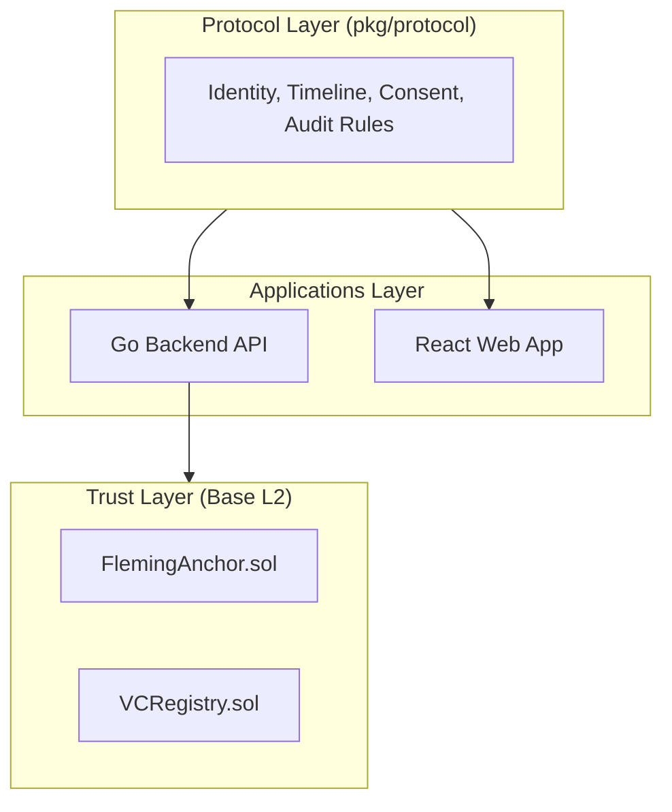

<div align="center">
  <h1>Fleming</h1>
  <p><strong>The Patient-Sovereign Health Protocol</strong></p>

  <p>
    <a href="https://github.com/itspablomontes/fleming/pulls"></a>
    <a href="https://github.com/itspablomontes/fleming/blob/main/LICENSE"></a>
    <a href="https://github.com/itspablomontes/fleming/stargazers"></a>
    <a href="https://github.com/itspablomontes/fleming/network/members"></a>
  </p>
</div>

---

## 🧬 Own Your Biological Timeline

**Healthcare data is broken.** Today, your medical history lives in provider-owned silos—scattered, difficult to port, and impossible to cryptographically verify. When you move, your history doesn't follow. When you claim a health result, you lack the proof.

**Fleming inverts this power dynamic.**

Fleming is a patient-centric protocol that allows you to own a **cryptographic root of trust** for your entire biological history. By separating data storage from verification, Fleming ensures sensitive records stay off-chain (private and deletable), while cryptographic commitments and revocations live on-chain (Base L2).

### *Self-Sovereign Identity. End-to-End Privacy. Verifiable Evidence.*

---

## ⚡ Why Fleming?

- **Eliminate Data Silos**: Your health data follows you, not the provider.
- **Cryptographic Trust**: Prove your biological age or lab results without manual verification.
- **Selective Disclosure**: Share only what is necessary, for as long as you choose.
- **DeSci Native**: Built for the next generation of decentralized science and longevity research.

---


## ✨ Key Highlights

- **🛡️ Self-Sovereign Identity**: Your wallet is your identity. Authentication via SIWE—no passwords, no central accounts.
- **🔒 Privacy by Design**: End-to-end client-side encryption. The protocol ensures that PII and sensitive records are never seen by the backend in plaintext.
- **📈 Timeline Graph**: An append-only graph that interwines events (labs, medications, interventions) with cryptographic relationships.
- **🤝 Granular Consent**: A state-machine-driven consent engine that allows patients to grant time-bound, specific access to providers and researchers.
- **🔗 Verifiable Audit**: Every operation is recorded in a hash-chained audit log, with Merkle roots anchored on-chain for tamper-proof integrity.

---

## 🏗️ Architecture

Fleming is built as a **protocol-first** monorepo. The core logic lives in the protocol package, ensuring absolute consistency across the backend and web applications.



Deep dive into the system design: **[docs/ARCHITECTURE.md](docs/ARCHITECTURE.md)**

---

## 🚀 Quick Start

### 1. Prerequisites
Ensure you have **Docker** and **Docker Compose** installed. For local development, you'll need Go 1.25+, Node 21+, and pnpm.

### 2. Up and Running
```bash
# Clone and configure
git clone https://github.com/itspablomontes/fleming.git
cd fleming
cp .env.example .env

# Start the stack
docker compose up
```

### 3. Services
- **Web App**: http://localhost:5173
- **Backend API**: http://localhost:8080
- **MinIO Console**: http://localhost:9001

---

## 📂 Code Tour

| Directory       | Purpose                                                                             |
| :-------------- | :---------------------------------------------------------------------------------- |
| `apps/backend/` | Go API server handling logic, auth, and chain integration.                          |
| `apps/web/`     | Modern React SPA (Vite + TanStack + Wagmi).                                         |
| `pkg/protocol/` | **The Source of Truth.** Shared library defining the core protocol types and rules. |
| `contracts/`    | Solidity smart contracts using Foundry for on-chain anchoring.                      |
| `docs/`         | Comprehensive technical guides and architecture specs.                              |

---

## 🤝 Contributing

We welcome contributions from the DeSci and Longevity communities. Whether it's fixing bugs or proposing new protocol features, please open an [issue](https://github.com/itspablomontes/fleming/issues) or [pull request](https://github.com/itspablomontes/fleming/pulls).

---

## 📄 License

Fleming is released under the **MIT License**.
