# Fleming - System Architecture

> **Guiding Principle**: *"The Protocol is the source of truth. Applications are interfaces to it."*

---

## Executive Summary

### Vision

> **Fleming: Self-sovereign medical & longevity data protocol - prove what matters, reveal nothing else.**

Fleming is a ZK-powered selective disclosure protocol for patients, providers, communities, and research. It transforms how health data is owned, shared, and verified.

### The Core Shift

```
FROM: "The GitHub of Medical Data" - Secure vault for patient-doctor interaction
  TO: "Self-Sovereign Health Passport" - ZK-powered verifiable longevity identity layer
```

| Dimension         | Before                     | After                                |
| :---------------- | :------------------------- | :----------------------------------- |
| **Promise**       | Ownership + consent        | Cryptographic minimal disclosure     |
| **Metaphor**      | Encrypted vault            | Health passport / proof wallet       |
| **Privacy**       | E2EE + consent             | E2EE + ZK + selective disclosure     |
| **Trust**         | On-chain Merkle roots      | On-chain + ZK verifiers + revocation |
| **Research role** | Science without extraction | Verifiable real-world evidence layer |

### Target Users

Fleming serves the **longevity and biohacking community** — users who track HRV, VO2max, DEXA scans, blood panels, wearables, and interventions (e.g. rapamycin, NAD+, peptides). The protocol is token-free neutral infrastructure for research orgs and BioAgents: verifiable cohort eligibility, consented RWE feeds, and asset validation.

---

## 1. The Health Passport Concept

The Health Passport is a self-sovereign, ZK-powered, portable identity layer for health and longevity data.

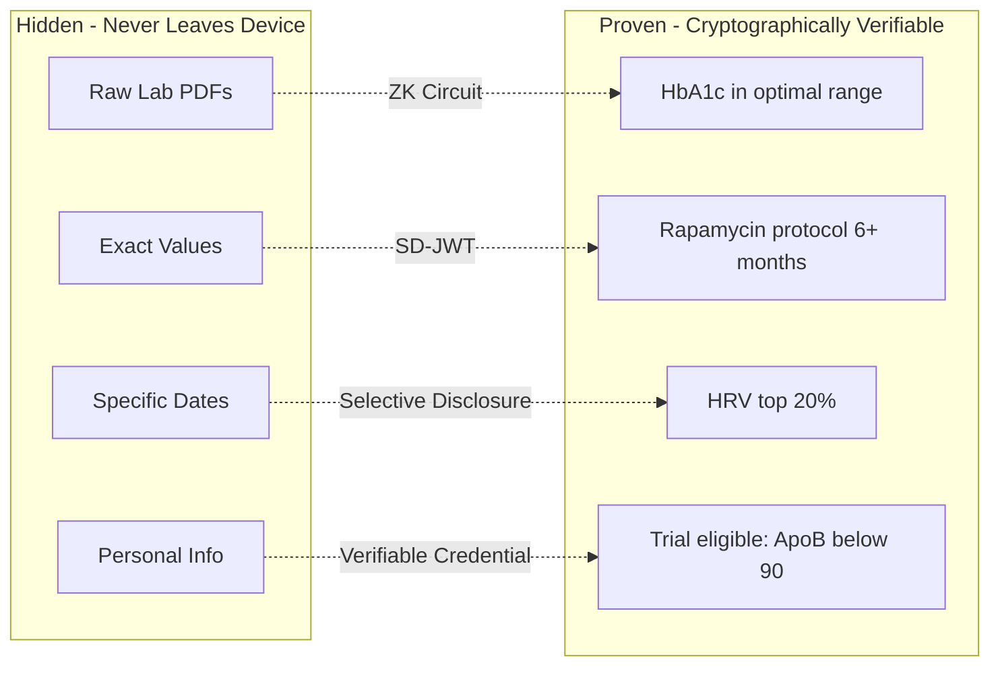
```mermaid
graph LR
    subgraph hidden [Hidden - Never Leaves Device]
        Raw[Raw Lab PDFs]
        Exact[Exact Values]
        Dates[Specific Dates]
        PII[Personal Info]
    end

    subgraph proven [Proven - Cryptographically Verifiable]
        Range["HbA1c in optimal range"]
        Duration["Rapamycin protocol 6+ months"]
        Percentile["HRV top 20%"]
        Eligibility["Trial eligible: ApoB below 90"]
    end

    Raw -.->|ZK Circuit| Range
    Exact -.->|SD-JWT| Duration
    Dates -.->|Selective Disclosure| Percentile
    PII -.->|Verifiable Credential| Eligibility
```

### What We Prove (Not What We Store)

| Claim Type             | Example                                | Mechanism            |
| :--------------------- | :------------------------------------- | :------------------- |
| **Range Proof**        | "HbA1c between 4.8-5.4% for 12 months" | ZK Circuit           |
| **Protocol Adherence** | "Rapamycin regimen >= 6 months"        | SD-JWT               |
| **Percentile Rank**    | "HRV in top 20th percentile"           | ZK Circuit           |
| **Cohort Eligibility** | "ApoB < 90 mg/dL"                      | SD-JWT + Attestation |
| **Stack Validation**   | "Active longevity protocol"            | Composite VC         |

### Key Properties

- **Prove without revealing**: VC/SD-JWT + ZK proofs for claims
- **Sovereignty first**: User owns keys, derives KEK, signs/attests, revokes instantly
- **Portable & verifiable**: QR/link to static verifier or verification bots
- **Research-ready**: Trial eligibility proofs, decentralized biobanks, asset validation

---

## 2. Three-Layer Architecture

Fleming is a **hybrid application** — centralized infrastructure for performance, decentralized protocols for trust.

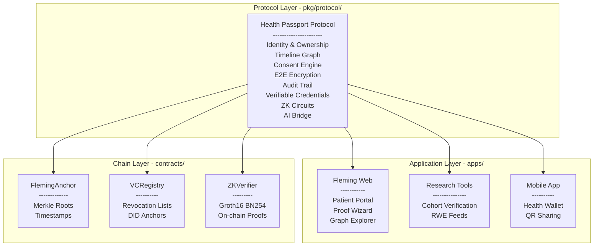
```mermaid
graph TB
    subgraph protocol_layer [Protocol Layer - pkg/protocol/]
        direction TB
        Protocol["Health Passport Protocol
        ----------------------
        Identity & Ownership
        Timeline Graph
        Consent Engine
        E2E Encryption
        Audit Trail
        Verifiable Credentials
        ZK Circuits
        AI Bridge"]
    end

    subgraph app_layer [Application Layer - apps/]
        direction LR
        Fleming["Fleming Web
        -----------
        Patient Portal
        Proof Wizard
        Graph Explorer"]
        ResearchApp["Research Tools
        ---------------
        Cohort Verification
        RWE Feeds"]
        Mobile["Mobile App
        ----------
        Health Wallet
        QR Sharing"]
    end

    subgraph chain_layer [Chain Layer - contracts/]
        direction LR
        Anchor["FlemingAnchor
        -------------
        Merkle Roots
        Timestamps"]
        Registry["VCRegistry
        ----------
        Revocation Lists
        DID Anchors"]
        Verifier["ZKVerifier
        ---------
        Groth16 BN254
        On-chain Proofs"]
    end

    Protocol --> Fleming
    Protocol --> ResearchApp
    Protocol --> Mobile
    Protocol --> Anchor
    Protocol --> Registry
    Protocol --> Verifier
```

| Layer           | Purpose                                                  | Location        | Who Uses It                                     |
| :-------------- | :------------------------------------------------------- | :-------------- | :---------------------------------------------- |
| **Protocol**    | Source of truth for health data, credentials, and proofs | `pkg/protocol/` | All applications                                |
| **Application** | User-facing interfaces built on the Protocol             | `apps/`         | Patients, providers, research orgs, researchers |
| **Chain**       | Cryptographic anchoring and verification (mandatory)     | `contracts/`    | Protocol (not users directly)                   |

---

## 3. System Context

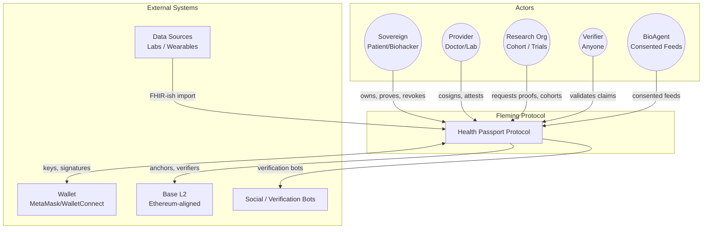
```mermaid
graph TB
    subgraph actors [Actors]
        Sovereign((Sovereign
        Patient/Biohacker))
        Provider((Provider
        Doctor/Lab))
        ResearchOrg((Research Org
        Cohort / Trials))
        Verifier((Verifier
        Anyone))
        BioAgent((BioAgent
        Consented Feeds))
    end

    subgraph fleming [Fleming Protocol]
        Protocol[Health Passport Protocol]
    end

    subgraph external [External Systems]
        Wallet[Wallet
        MetaMask/WalletConnect]
        Chain[Base L2
        Ethereum-aligned]
        Social[Social / Verification Bots]
        DataSources[Data Sources
        Labs / Wearables]
    end

    Sovereign -->|owns, proves, revokes| Protocol
    Provider -->|cosigns, attests| Protocol
    ResearchOrg -->|requests proofs, cohorts| Protocol
    Verifier -->|validates claims| Protocol
    BioAgent -->|consented feeds| Protocol

    Protocol <-->|keys, signatures| Wallet
    Protocol -->|anchors, verifiers| Chain
    Protocol -->|verification bots| Social
    DataSources -->|FHIR-ish import| Protocol
```

### User Personas

#### The Sovereign (Patient/Biohacker)
- **Goal**: "Own my health data and prove claims without revealing everything."
- **Key Actions**:
  - `Upload` records (encrypted, client-side)
  - `Prove` claims via SD-JWT or ZK proof
  - `Share` via QR/link with time limits
  - `Revoke` access instantly

#### The Provider (Doctor/Lab)
- **Goal**: "Attest to results I generated, never hold patient data."
- **Key Actions**:
  - `Cosign` events (attestation without custody)
  - `View` timeline (only while authorized)
  - `Generate` findings (append to patient graph)

#### The Research Org / Researcher
- **Goal**: "Find eligible cohorts and get consented, verified data."
- **Key Actions**:
  - `Request` eligibility proofs (e.g., "ApoB < 90")
  - `Query` aggregated, ZK-protected feeds
  - `Validate` RWE for trials and asset validation

#### The Verifier (Anyone)
- **Goal**: "Confirm a claim is valid without seeing underlying data."
- **Key Actions**:
  - `Scan` QR code or open proof link
  - `Verify` signature and claim validity
  - `Check` revocation status

#### The BioAgent
- **Goal**: "Generate hypotheses from consented, structured data."
- **Key Actions**:
  - `Consume` exported graph data (JSON-LD/RDF)
  - `Analyze` biomarker correlations
  - `Feed` insights to research pipelines

---

## 4. Protocol Components

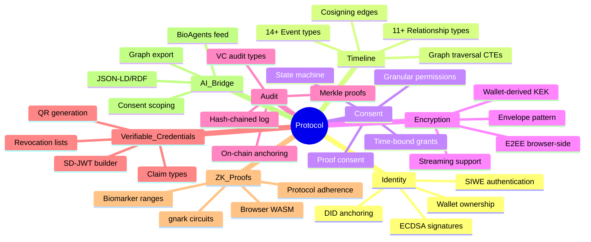
```mermaid
mindmap
  root((Protocol))
    Identity
      Wallet ownership
      SIWE authentication
      ECDSA signatures
      DID anchoring
    Timeline
      14+ Event types
      11+ Relationship types
      Graph traversal CTEs
      Cosigning edges
    Consent
      State machine
      Granular permissions
      Time-bound grants
      Proof consent
    Encryption
      E2EE browser-side
      Wallet-derived KEK
      Envelope pattern
      Streaming support
    Audit
      Hash-chained log
      Merkle proofs
      On-chain anchoring
      VC audit types
    Verifiable_Credentials
      SD-JWT builder
      Claim types
      Revocation lists
      QR generation
    ZK_Proofs
      gnark circuits
      Biomarker ranges
      Protocol adherence
      Browser WASM
    AI_Bridge
      Graph export
      JSON-LD/RDF
      Consent scoping
      BioAgents feed
```

### 4.1 Identity (`pkg/protocol/identity/`)

Wallet-based ownership with SIWE (Sign-In with Ethereum) authentication.

```
pkg/protocol/identity/
├── siwe.go          # EIP-4361 message building
├── verify.go        # Signature verification
├── did.go           # DID resolution (did:ethr/pkh)
└── types.go         # WalletAddress, Principal
```

### 4.2 Timeline Graph (`pkg/protocol/timeline/`)

Append-only graph of medical events with rich relationships.

```
pkg/protocol/timeline/
├── event.go             # 23 event types (see below)
├── event_registry.go    # Extensible event type registry
├── relationship.go      # 17 edge types (see below)
├── relationship_registry.go  # Extensible relationship type registry
├── graph.go             # Graph interfaces (GraphReader, GraphWriter)
├── builder.go           # Event builder pattern
└── edge_builder.go      # Edge builder pattern
```

Note: Coding systems (`coding.go`) are in `pkg/protocol/types/`.

**Event Types** (snake_case in code):
- Medical: `consultation`, `diagnosis`, `prescription`, `procedure`, `lab_result`, `imaging`, `note`, `vaccination`, `allergy`, `visit_note`, `vital_signs`, `referral`, `insurance_claim`
- Longevity: `medication`, `supplement`, `biometric`, `intervention`
- History: `family_history`, `social_history`, `document`
- System: `tombstone`, `other`, `vital`

**Relationship Types** (snake_case in code):
- Core: `resulted_in`, `lead_to`, `requested_by`, `supports`, `follows_up`, `contradicts`, `attached_to`, `replaces`, `caused_by`
- Attestation: `cosigned_by`, `attested_by`
- Medical: `treats`, `monitors`, `contraindicated`, `derived_from`, `part_of`
- AI: `suggested_by`

### 4.3 Consent Engine (`pkg/protocol/consent/`)

State machine for granular, time-bound access control.

```
pkg/protocol/consent/
├── state.go         # State machine (6 states)
├── grant.go         # Permissions, expiration, scope
├── proof.go         # Consent for proof generation
└── types.go         # Permission types, grant structures
```

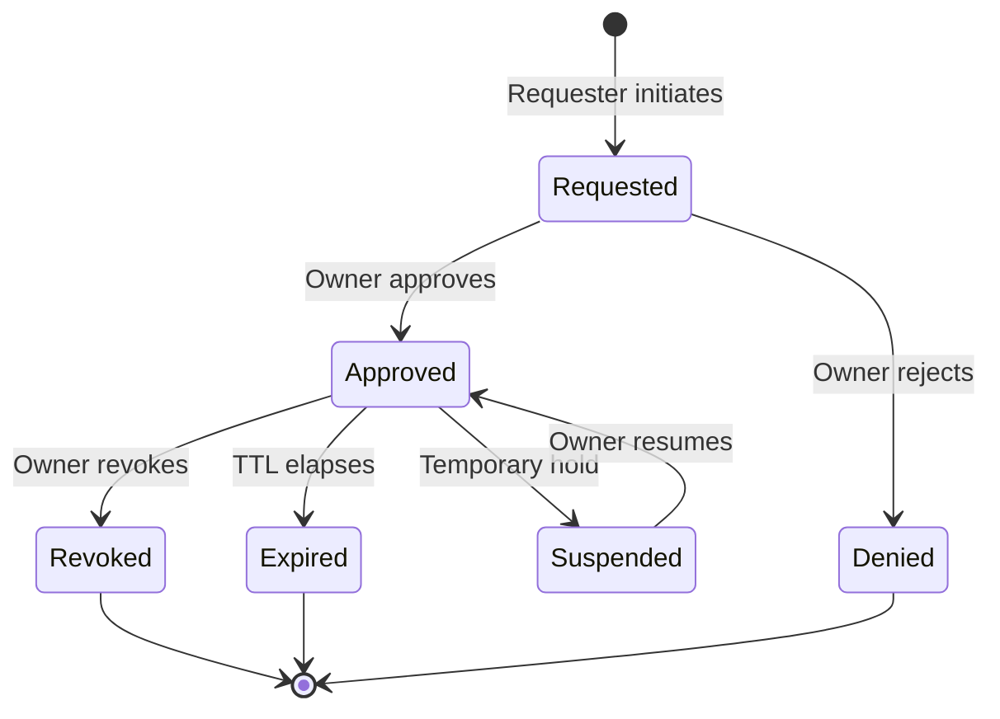
```mermaid
stateDiagram-v2
    [*] --> Requested : Requester initiates
    Requested --> Approved : Owner approves
    Requested --> Denied : Owner rejects
    Approved --> Revoked : Owner revokes
    Approved --> Expired : TTL elapses
    Approved --> Suspended : Temporary hold
    Suspended --> Approved : Owner resumes
    Revoked --> [*]
    Expired --> [*]
    Denied --> [*]
```

### 4.4 Encryption (`pkg/protocol/crypto/`)

Client-side E2EE with wallet-derived keys.

```
pkg/protocol/crypto/
├── kek.go           # Key Encryption Key derivation (HKDF)
├── dek.go           # Data Encryption Key generation
├── envelope.go      # Envelope encryption pattern
└── interfaces.go    # Encryption/decryption interfaces
```

### 4.5 Audit Trail (`pkg/protocol/audit/`)

Hash-chained, tamper-evident audit log with Merkle anchoring.

```
pkg/protocol/audit/
├── entry.go         # Audit entry types (incl. IssueVC, GenerateZKProof, CosignAttestation)
├── log.go           # Append-only log interface
├── merkle.go        # Merkle tree construction
└── verify.go        # Integrity verification
```

**Audit Entry Types** (dot-notation in code):
- CRUD: `create`, `read`, `update`, `delete`
- Consent: `consent.request`, `consent.approve`, `consent.deny`, `consent.revoke`, `consent.expire`, `consent.suspend`, `consent.resume`
- Auth: `auth.login`, `auth.logout`
- Files: `file.upload`, `file.download`, `file.share`
- VC: `vc.issue`, `vc.revoke`, `vc.verify`, `vc.present`
- ZK: `zk.generate`, `zk.verify`
- Attestation: `attestation.cosign`, `attestation.attest`

### 4.6 Verifiable Credentials (`pkg/protocol/vc/`)

SD-JWT based verifiable credentials with selective disclosure.

```
pkg/protocol/vc/
├── builder.go       # SD-JWT construction
├── claims.go        # Claim types (BloodworkRange, ProtocolAdherence, etc.)
├── disclosure.go    # Selective disclosure logic
├── revocation.go    # Bitmap revocation lists
└── types.go         # Credential structures
```

**Claim Types**:

| Claim                 | Description                    | Fields                                   |
| :-------------------- | :----------------------------- | :--------------------------------------- |
| `BloodworkRange`      | Biomarker within optimal range | marker, rangeMin, rangeMax, windowMonths |
| `ProtocolAdherence`   | Intervention duration          | intervention, minDurationMonths          |
| `BiometricPercentile` | Metric percentile rank         | metric, percentile, population           |
| `CohortEligibility`   | Trial/study eligibility        | criteria[], attestedBy                   |
| `ProviderAttestation` | Cosigned accuracy              | eventHash, attestationType               |

### 4.7 Zero-Knowledge Proofs (`pkg/protocol/zk/`)

gnark-based circuits for privacy-preserving proofs.

```
pkg/protocol/zk/
├── circuits/
│   ├── range.go         # Biomarker range proof
│   ├── adherence.go     # Protocol adherence proof
│   ├── percentile.go    # Percentile rank proof
│   └── composite.go     # Multi-claim composite proof
├── prover.go            # Proof generation
├── verifier.go          # Proof verification
└── wasm/                # Browser WASM bindings
```

**Circuits**:

| Circuit           | Proves                | Public Inputs          | Private Inputs     |
| :---------------- | :-------------------- | :--------------------- | :----------------- |
| `RangeProof`      | Value in [min, max]   | min, max, commitment   | value, randomness  |
| `AdherenceProof`  | Duration >= threshold | threshold, commitment  | startDate, endDate |
| `PercentileProof` | Rank >= percentile    | percentile, population | actualRank         |
| `CompositeProof`  | Multiple claims       | claim commitments      | individual proofs  |

### 4.8 AI Bridge (`pkg/protocol/ai_bridge/`)

Consented data export for AI agents and research.

```
pkg/protocol/ai_bridge/
├── export.go        # Graph serialization
├── formats.go       # JSON-LD, RDF, FHIR bundle
├── consent.go       # Scope filtering
└── bioagents.go     # BioAgents integration helpers
```

---

## 5. Data Flows

### 5.1 Smart Ingestion Flow

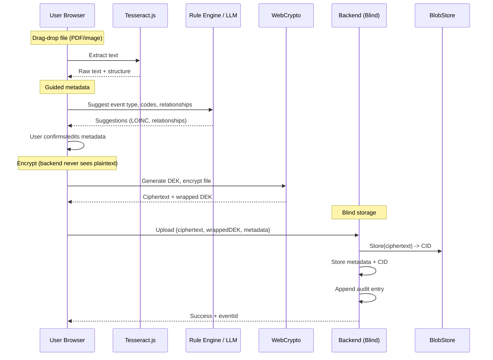
```mermaid
sequenceDiagram
    participant U as User Browser
    participant OCR as Tesseract.js
    participant LLM as Rule Engine / LLM
    participant Crypto as WebCrypto
    participant B as Backend (Blind)
    participant S as BlobStore

    Note over U: Drag-drop file (PDF/image)
    U->>OCR: Extract text
    OCR-->>U: Raw text + structure
    
    Note over U: Guided metadata
    U->>LLM: Suggest event type, codes, relationships
    LLM-->>U: Suggestions (LOINC, relationships)
    U->>U: User confirms/edits metadata
    
    Note over U: Encrypt (backend never sees plaintext)
    U->>Crypto: Generate DEK, encrypt file
    Crypto-->>U: Ciphertext + wrapped DEK
    
    Note over B: Blind storage
    U->>B: Upload {ciphertext, wrappedDEK, metadata}
    B->>S: Store(ciphertext) -> CID
    B->>B: Store metadata + CID
    B->>B: Append audit entry
    B-->>U: Success + eventId
```

### 5.2 VC Issuance Flow (SD-JWT)

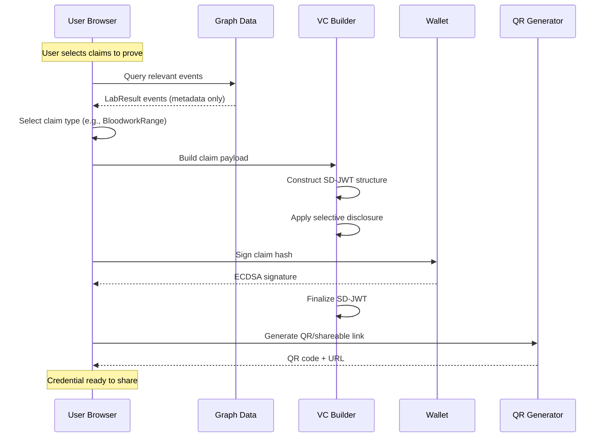
```mermaid
sequenceDiagram
    participant U as User Browser
    participant G as Graph Data
    participant VC as VC Builder
    participant W as Wallet
    participant QR as QR Generator

    Note over U: User selects claims to prove
    U->>G: Query relevant events
    G-->>U: LabResult events (metadata only)
    
    U->>U: Select claim type (e.g., BloodworkRange)
    U->>VC: Build claim payload
    VC->>VC: Construct SD-JWT structure
    VC->>VC: Apply selective disclosure
    
    U->>W: Sign claim hash
    W-->>U: ECDSA signature
    
    VC->>VC: Finalize SD-JWT
    U->>QR: Generate QR/shareable link
    QR-->>U: QR code + URL
    
    Note over U: Credential ready to share
```

### 5.3 ZK Proof Generation Flow

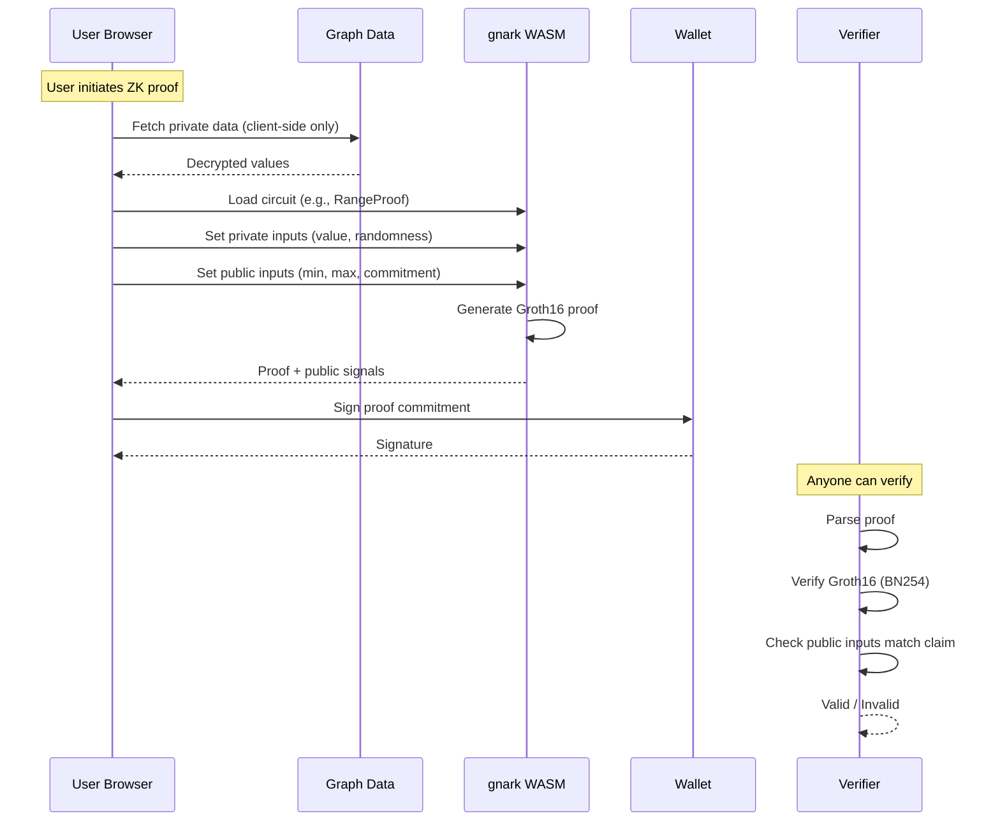
```mermaid
sequenceDiagram
    participant U as User Browser
    participant G as Graph Data
    participant ZK as gnark WASM
    participant W as Wallet
    participant V as Verifier

    Note over U: User initiates ZK proof
    U->>G: Fetch private data (client-side only)
    G-->>U: Decrypted values
    
    U->>ZK: Load circuit (e.g., RangeProof)
    U->>ZK: Set private inputs (value, randomness)
    U->>ZK: Set public inputs (min, max, commitment)
    ZK->>ZK: Generate Groth16 proof
    ZK-->>U: Proof + public signals
    
    U->>W: Sign proof commitment
    W-->>U: Signature
    
    Note over V: Anyone can verify
    V->>V: Parse proof
    V->>V: Verify Groth16 (BN254)
    V->>V: Check public inputs match claim
    V-->>V: Valid / Invalid
```

### 5.4 Cosigning Flow (Provider Attestation)

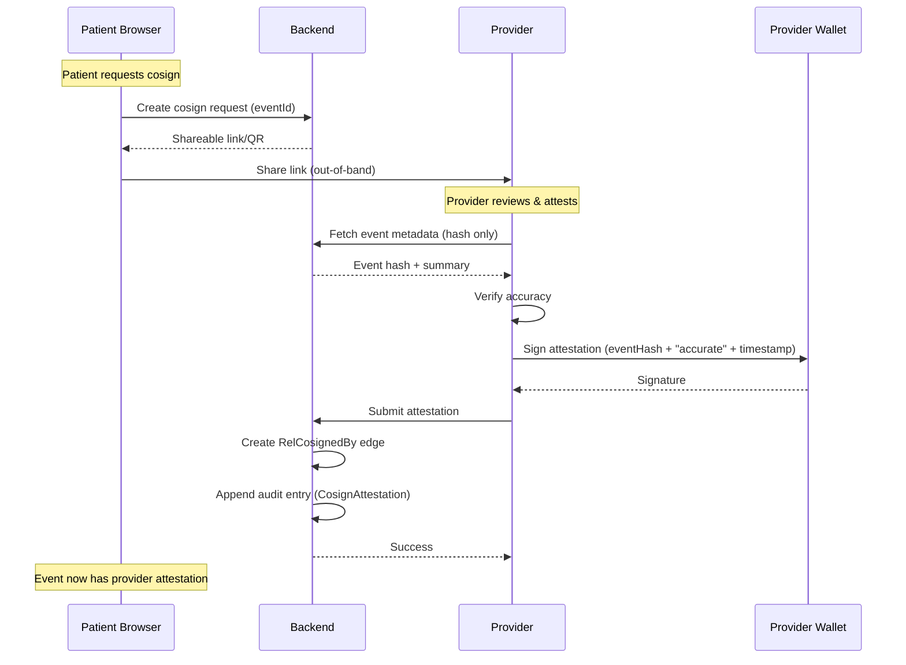
```mermaid
sequenceDiagram
    participant P as Patient Browser
    participant B as Backend
    participant Pr as Provider
    participant W as Provider Wallet

    Note over P: Patient requests cosign
    P->>B: Create cosign request (eventId)
    B-->>P: Shareable link/QR
    
    P->>Pr: Share link (out-of-band)
    
    Note over Pr: Provider reviews & attests
    Pr->>B: Fetch event metadata (hash only)
    B-->>Pr: Event hash + summary
    
    Pr->>Pr: Verify accuracy
    Pr->>W: Sign attestation (eventHash + "accurate" + timestamp)
    W-->>Pr: Signature
    
    Pr->>B: Submit attestation
    B->>B: Create RelCosignedBy edge
    B->>B: Append audit entry (CosignAttestation)
    B-->>Pr: Success
    
    Note over P: Event now has provider attestation
```

### 5.5 Verification Flow

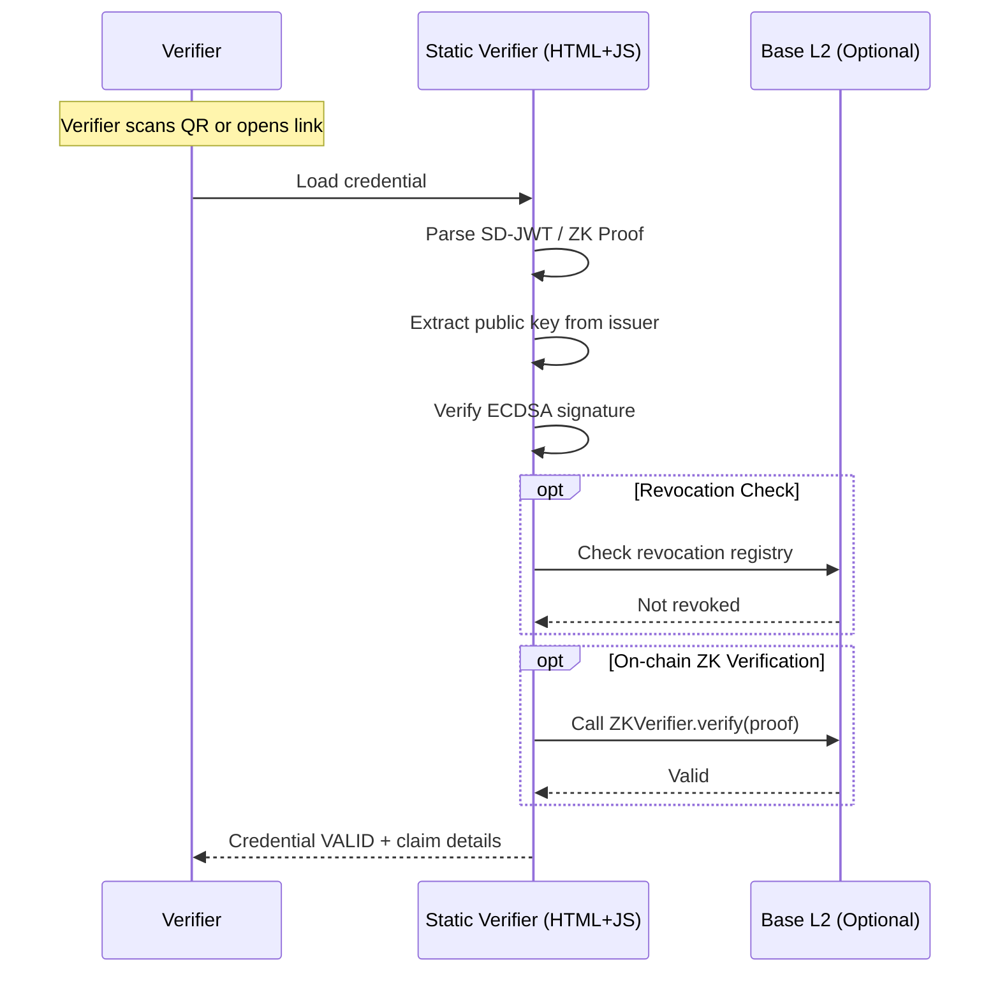
```mermaid
sequenceDiagram
    participant V as Verifier
    participant Static as Static Verifier (HTML+JS)
    participant Chain as Base L2 (Optional)

    Note over V: Verifier scans QR or opens link
    V->>Static: Load credential
    
    Static->>Static: Parse SD-JWT / ZK Proof
    Static->>Static: Extract public key from issuer
    Static->>Static: Verify ECDSA signature
    
    opt Revocation Check
        Static->>Chain: Check revocation registry
        Chain-->>Static: Not revoked
    end
    
    opt On-chain ZK Verification
        Static->>Chain: Call ZKVerifier.verify(proof)
        Chain-->>Static: Valid
    end
    
    Static-->>V: Credential VALID + claim details
```

### 5.6 AI Bridge Export Flow

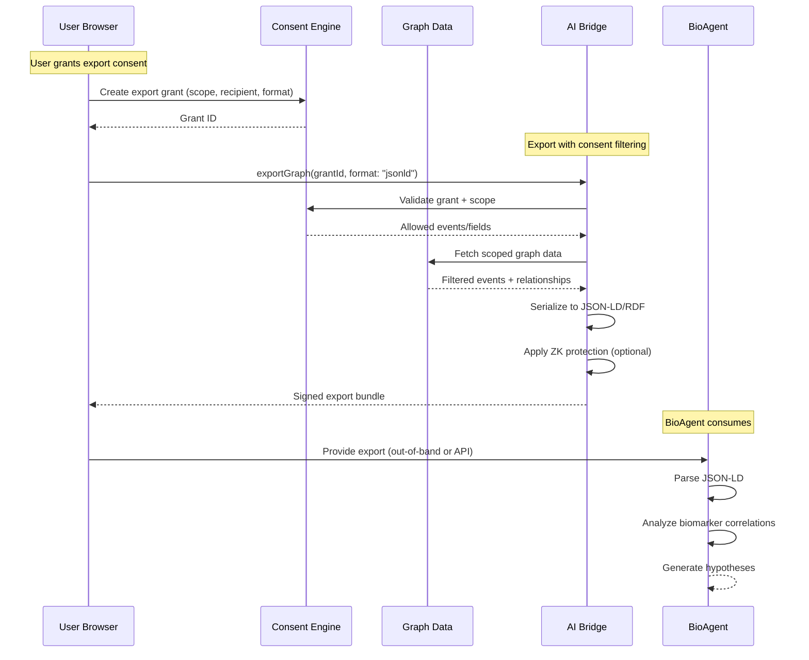
```mermaid
sequenceDiagram
    participant U as User Browser
    participant C as Consent Engine
    participant G as Graph Data
    participant E as AI Bridge
    participant A as BioAgent

    Note over U: User grants export consent
    U->>C: Create export grant (scope, recipient, format)
    C-->>U: Grant ID
    
    Note over E: Export with consent filtering
    U->>E: exportGraph(grantId, format: "jsonld")
    E->>C: Validate grant + scope
    C-->>E: Allowed events/fields
    
    E->>G: Fetch scoped graph data
    G-->>E: Filtered events + relationships
    
    E->>E: Serialize to JSON-LD/RDF
    E->>E: Apply ZK protection (optional)
    E-->>U: Signed export bundle
    
    Note over A: BioAgent consumes
    U->>A: Provide export (out-of-band or API)
    A->>A: Parse JSON-LD
    A->>A: Analyze biomarker correlations
    A-->>A: Generate hypotheses
```

---

## 6. Client-Side Architecture

All sensitive operations happen in the browser. The backend is blind to plaintext.

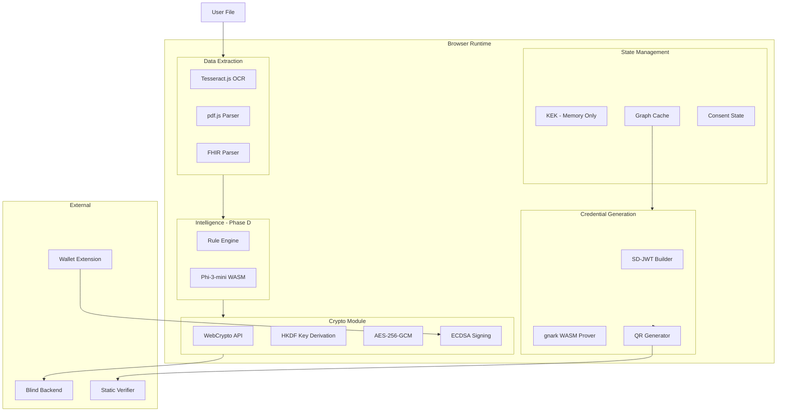
```mermaid
graph TB
    subgraph browser [Browser Runtime]
        subgraph crypto [Crypto Module]
            WebCrypto[WebCrypto API]
            HKDF[HKDF Key Derivation]
            AES[AES-256-GCM]
            ECDSA[ECDSA Signing]
        end
        
        subgraph extraction [Data Extraction]
            Tesseract[Tesseract.js OCR]
            PDFjs[pdf.js Parser]
            FHIR[FHIR Parser]
        end
        
        subgraph intelligence [Intelligence - Phase D]
            Rules[Rule Engine]
            LLM[Phi-3-mini WASM]
        end
        
        subgraph credentials [Credential Generation]
            SDJWT[SD-JWT Builder]
            ZKProver[gnark WASM Prover]
            QRGen[QR Generator]
        end
        
        subgraph state [State Management]
            KEK[KEK - Memory Only]
            Graph[Graph Cache]
            Consent[Consent State]
        end
    end
    
    subgraph external [External]
        Wallet[Wallet Extension]
        Backend[Blind Backend]
        Verifier[Static Verifier]
    end
    
    File[User File] --> extraction
    extraction --> intelligence
    intelligence --> crypto
    crypto --> Backend
    
    Graph --> credentials
    Wallet --> ECDSA
    credentials --> QRGen
    QRGen --> Verifier
```

### Key Principle: Backend Blindness

| Data                | Backend Sees  | Backend Stores   |
| :------------------ | :------------ | :--------------- |
| File content        | Never         | Ciphertext only  |
| Decryption keys     | Never         | Wrapped DEK only |
| VC claims           | Never         | Hash + metadata  |
| ZK private inputs   | Never         | Proof only       |
| Graph relationships | Metadata only | Metadata only    |

---

## 7. End-to-End Encryption

### Key Hierarchy

```
WALLET PRIVATE KEY (never leaves wallet)
  |
  +-- Signs deterministic message ("Fleming Key Derivation v1")
        |
        +-- Signature (never stored)
              |
              +-- HKDF derivation (SHA-256, salt: "fleming-kek")
                    |
                    +-- KEK (Key Encryption Key) - memory only
                          |
                          +-- Wraps per-file DEKs (AES-256-GCM)
```

| Key                | Location                 | Holder                  |
| :----------------- | :----------------------- | :---------------------- |
| Wallet Private Key | Hardware/software wallet | User only               |
| KEK                | Browser memory           | User only               |
| Wrapped DEK        | Postgres                 | Backend (cannot unwrap) |
| DEK (plaintext)    | Browser memory (temp)    | User only               |

### Encryption Flow

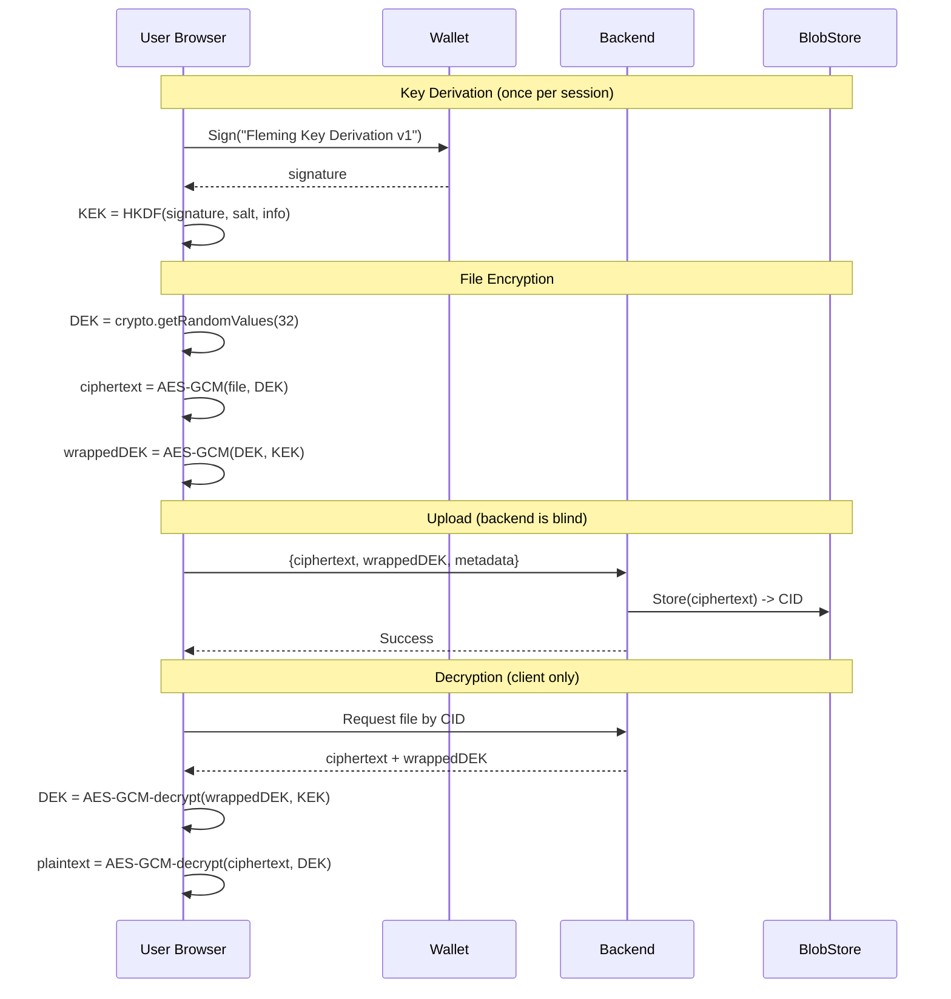
```mermaid
sequenceDiagram
    participant U as User Browser
    participant W as Wallet
    participant B as Backend
    participant S as BlobStore

    Note over U,S: Key Derivation (once per session)
    U->>W: Sign("Fleming Key Derivation v1")
    W-->>U: signature
    U->>U: KEK = HKDF(signature, salt, info)

    Note over U,S: File Encryption
    U->>U: DEK = crypto.getRandomValues(32)
    U->>U: ciphertext = AES-GCM(file, DEK)
    U->>U: wrappedDEK = AES-GCM(DEK, KEK)

    Note over U,S: Upload (backend is blind)
    U->>B: {ciphertext, wrappedDEK, metadata}
    B->>S: Store(ciphertext) -> CID
    B-->>U: Success

    Note over U,S: Decryption (client only)
    U->>B: Request file by CID
    B-->>U: ciphertext + wrappedDEK
    U->>U: DEK = AES-GCM-decrypt(wrappedDEK, KEK)
    U->>U: plaintext = AES-GCM-decrypt(ciphertext, DEK)
```

---

## 8. Zero-Knowledge Proofs

### Circuit Architecture

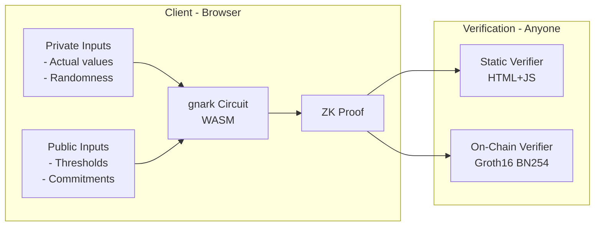
```mermaid
graph LR
    subgraph client [Client - Browser]
        Private[Private Inputs
        - Actual values
        - Randomness]
        Public[Public Inputs
        - Thresholds
        - Commitments]
        Circuit[gnark Circuit
        WASM]
        Proof[ZK Proof]
        
        Private --> Circuit
        Public --> Circuit
        Circuit --> Proof
    end

    subgraph verify [Verification - Anyone]
        StaticV[Static Verifier
        HTML+JS]
        OnChain[On-Chain Verifier
        Groth16 BN254]
        
        Proof --> StaticV
        Proof --> OnChain
    end
```

### Supported Circuits

| Circuit             | Use Case                                           | Longevity Example               |
| :------------------ | :------------------------------------------------- | :------------------------------ |
| `BiomarkerRange`    | Prove value in range without revealing exact value | "HbA1c between 4.8-5.4%"        |
| `ProtocolAdherence` | Prove duration >= threshold                        | "On rapamycin 6+ months"        |
| `PercentileRank`    | Prove percentile without revealing actual value    | "HRV in top 20%"                |
| `AggregateRange`    | Prove all values in ranges                         | "All longevity markers optimal" |

### Technology Stack

- **gnark** (Go): Circuit definition and proof generation
- **Groth16**: Proof system (small proofs, fast verification)
- **BN254**: Elliptic curve (Ethereum-compatible, ~200 bytes proof)
- **WASM**: Browser-side proof generation

---

## 9. Smart Contracts

> **Chain**: Base L2 — Ethereum-aligned, low cost.

### On-Chain Strategy & Prioritization

Post-MVP, on-chain additions should be **minimal, low-frequency, and focused on trust anchors/verifiability**. Only include elements that solve real pain for users, research orgs, and researchers without bloating gas costs or complexity.

**Guiding Constraints**:
- Only immutable trust anchors belong on-chain (hashes, verifiers, revocation)
- Frequent/complex logic (consent, graph, issuance) stays off-chain in Go protocol
- Avoid: on-chain consent state, graph storage, proof issuance, token/governance
- Gas rule: Keep total per-user lifetime cost < $0.10–$0.20

**On-Chain Prioritization** (Highest to Lowest Value):

1. **VC Registry + Revocation Bitmap** (Highest Value - Phase C Priority)
   - Stores only VC/SD-JWT hashes (not content)
   - Maintains efficient revocation bitmap (1 bit per VC ID)
   - Emits indexed events for issuance/revocation
   - **Value**: Instant, trustless revocation; prevents stale credentials; critical for privacy (GDPR-like right to revoke)
   - **Gas**: ~65k per revocation (~$0.0015 on Base)
   - **Why highest**: Revocation is non-negotiable for credible, privacy-first proofs

2. **ZK Verifier Contract** (Very High Value - Phase C)
   - Groth16 BN254 verifier: `verifyProof(proof, publicInputs) → bool`
   - Public function for anyone to check zk-proofs
   - **Value**: Trustless verification; enables on-chain gating; credibility for research use
   - **Gas**: ~300k per verification (~$0.007 on Base) — rare use
   - **Why very high**: Makes ZK the killer differentiator; trustless claims are core

3. **DID Anchor / Registry** (High Value - Phase C/D)
   - Anchors user DID documents (did:ethr or did:pkh) + updates
   - Stores DID → address mapping (or hash of DID doc)
   - **Value**: Portable/resolvable identity; future-proof for cross-protocol sharing
   - **Gas**: ~80k per anchor/update (~$0.002 on Base)
   - **Why high**: Enables long-term interoperability, but less immediate pain than revocation/ZK

4. **Proof Commitment Events / Indexing Hooks** (Medium-High Value - Phase D/E)
   - Indexed events: `ProofIssued(user, claimType, proofHash)`
   - No storage — just logs for off-chain indexing (The Graph, custom subgraphs)
   - **Value**: Discoverability; transparency; scales collaboration (cohort matching for trials)
   - **Gas**: ~50k per event (~$0.001) — optional per issuance
   - **Why medium-high**: Unlocks ecosystem growth, but needs users/proofs first (chicken-egg)

### Contract Architecture

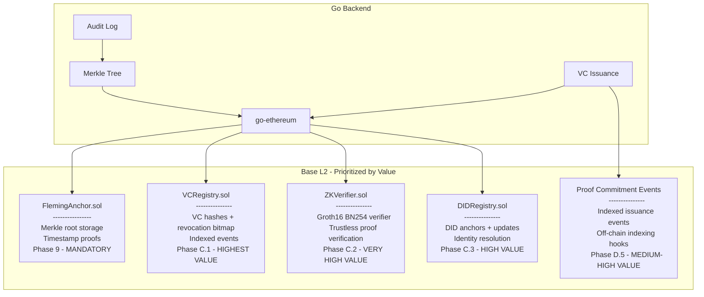
```mermaid
graph TB
    subgraph base [Base L2 - Prioritized by Value]
        Anchor[FlemingAnchor.sol
        ----------------
        Merkle root storage
        Timestamp proofs
        Phase 9 - MANDATORY]
        
        VCRegistry[VCRegistry.sol
        ---------------
        VC hashes + revocation bitmap
        Indexed events
        Phase C.1 - HIGHEST VALUE]
        
        ZKVerifier[ZKVerifier.sol
        ---------------
        Groth16 BN254 verifier
        Trustless proof verification
        Phase C.2 - VERY HIGH VALUE]
        
        DIDRegistry[DIDRegistry.sol
        ---------------
        DID anchors + updates
        Identity resolution
        Phase C.3 - HIGH VALUE]
        
        ProofEvents[Proof Commitment Events
        ---------------
        Indexed issuance events
        Off-chain indexing hooks
        Phase D.5 - MEDIUM-HIGH VALUE]
    end
    
    subgraph backend [Go Backend]
        Audit[Audit Log]
        Merkle[Merkle Tree]
        VC[VC Issuance]
        Eth[go-ethereum]
    end
    
    Audit --> Merkle
    Merkle --> Eth
    VC --> Eth
    Eth --> Anchor
    Eth --> VCRegistry
    Eth --> ZKVerifier
    Eth --> DIDRegistry
    VC --> ProofEvents
```

### On-Chain Prioritization Flow

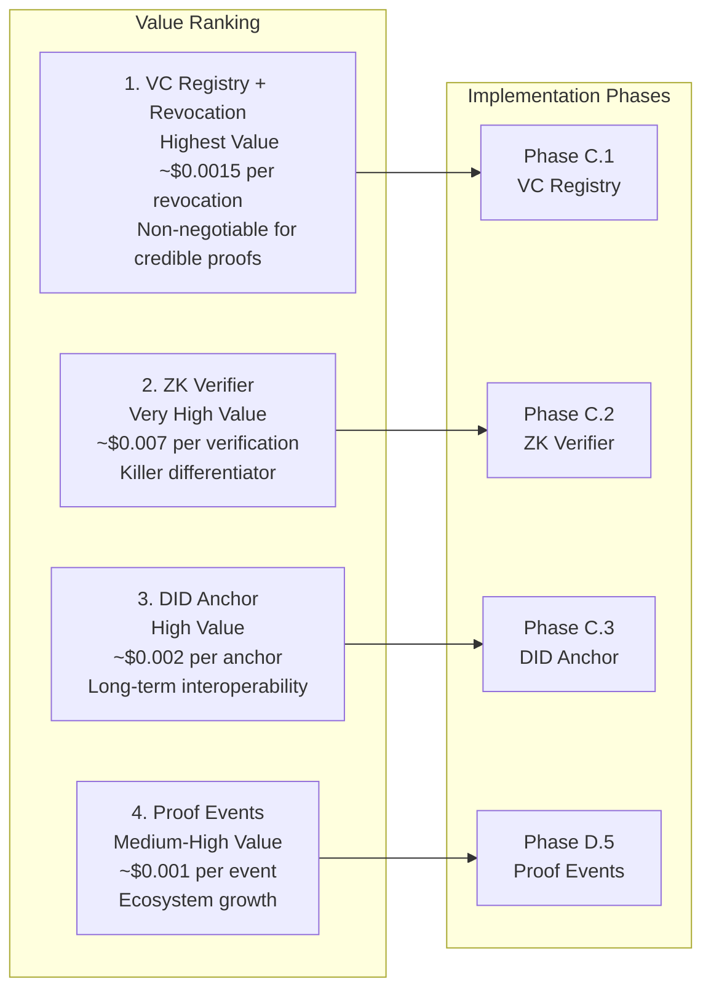
```mermaid
graph LR
    subgraph priority [Value Ranking]
        P1["1. VC Registry + Revocation
        Highest Value
        ~$0.0015 per revocation
        Non-negotiable for credible proofs"]
        P2["2. ZK Verifier
        Very High Value
        ~$0.007 per verification
        Killer differentiator"]
        P3["3. DID Anchor
        High Value
        ~$0.002 per anchor
        Long-term interoperability"]
        P4["4. Proof Events
        Medium-High Value
        ~$0.001 per event
        Ecosystem growth"]
    end
    
    subgraph phases [Implementation Phases]
        C1[Phase C.1
        VC Registry]
        C2[Phase C.2
        ZK Verifier]
        C3[Phase C.3
        DID Anchor]
        D5[Phase D.5
        Proof Events]
    end
    
    P1 --> C1
    P2 --> C2
    P3 --> C3
    P4 --> D5
```

### On-Chain vs Off-Chain Decision Framework

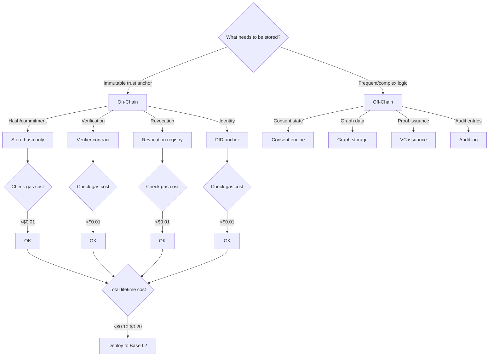
```mermaid
graph TD
    Start{What needs to be stored?}
    
    Start -->|Immutable trust anchor| OnChain[On-Chain]
    Start -->|Frequent/complex logic| OffChain[Off-Chain]
    
    OnChain -->|Hash/commitment| Hash[Store hash only]
    OnChain -->|Verification| Verify[Verifier contract]
    OnChain -->|Revocation| Revoke[Revocation registry]
    OnChain -->|Identity| DID[DID anchor]
    
    OffChain -->|Consent state| Consent[Consent engine]
    OffChain -->|Graph data| Graph[Graph storage]
    OffChain -->|Proof issuance| Issue[VC issuance]
    OffChain -->|Audit entries| Audit[Audit log]
    
    Hash --> Cost1{Check gas cost}
    Verify --> Cost2{Check gas cost}
    Revoke --> Cost3{Check gas cost}
    DID --> Cost4{Check gas cost}
    
    Cost1 -->|<$0.01| OK1[OK]
    Cost2 -->|<$0.01| OK2[OK]
    Cost3 -->|<$0.01| OK3[OK]
    Cost4 -->|<$0.01| OK4[OK]
    
    OK1 --> Lifetime{Total lifetime cost}
    OK2 --> Lifetime
    OK3 --> Lifetime
    OK4 --> Lifetime
    
    Lifetime -->|<$0.10-$0.20| Deploy[Deploy to Base L2]
```

### On-Chain vs Off-Chain

| Data                        | Location             | Rationale                                  |
| :-------------------------- | :------------------- | :----------------------------------------- |
| Patient records             | Off-chain            | Privacy, cost, size                        |
| VC claim content            | Off-chain            | Privacy                                    |
| Consent grants              | Off-chain            | Frequent updates, complex state            |
| Audit entries               | Off-chain            | Volume, frequent writes                    |
| Graph data                  | Off-chain            | Complex relationships, frequent updates    |
| Proof issuance              | Off-chain            | Complex logic, frequent operations         |
| **Merkle roots**            | On-chain (mandatory) | Tamper-evidence, immutable anchor          |
| **VC hashes**               | On-chain (Phase C.1) | Revocation registry, trust anchor          |
| **ZK verifier**             | On-chain (Phase C.2) | Trustless verification, public good        |
| **DID anchors**             | On-chain (Phase C.3) | Identity verification, portability         |
| **Proof commitment events** | On-chain (Phase D.5) | Indexing hooks, discoverability (optional) |

### Gas Costs (Base L2)

| Operation          | Gas      | Cost     | Frequency                        | Lifetime Cost      |
| :----------------- | :------- | :------- | :------------------------------- | :----------------- |
| Anchor Merkle root | ~50,000  | ~$0.001  | Daily (batch)                    | ~$0.03/month       |
| Register VC hash   | ~65,000  | ~$0.0015 | Per VC issuance                  | ~$0.0015 per VC    |
| Revoke VC          | ~45,000  | ~$0.001  | Per revocation                   | ~$0.001 per revoke |
| Verify ZK proof    | ~300,000 | ~$0.007  | Rare (on-demand)                 | ~$0.007 per verify |
| Anchor DID         | ~80,000  | ~$0.002  | Once per user                    | ~$0.002 per user   |
| Emit proof event   | ~50,000  | ~$0.001  | Optional per proof (user opt-in) | ~$0.001 per event  |

**Total per-user lifetime cost target**: < $0.10–$0.20

### Recommended On-Chain Roadmap

**Phase C - Core Trust Layer**:
- VC Registry + Revocation Bitmap (highest priority - non-negotiable)
- ZK Verifier Contract (very high priority - killer differentiator)

**Phase D - Scaling & Portability**:
- DID Anchor (high priority - long-term interoperability)
- Proof Commitment Events (medium-high priority - ecosystem growth)

This prioritization ensures we solve the biggest trust/privacy gaps first (revocation) while building toward ecosystem growth (DID, indexing). VC Registry + Revocation should be implemented first as it's non-negotiable for credible, privacy-first proofs.

---

## 10. Security Model

| Layer                    | Mechanism                          | Threat Mitigated                    |
| :----------------------- | :--------------------------------- | :---------------------------------- |
| **Transport**            | HTTPS (TLS 1.3)                    | Eavesdropping, MITM                 |
| **Authentication**       | SIWE + JWT (short TTL)             | Credential theft                    |
| **Authorization**        | Consent Engine (ABAC)              | Unauthorized access                 |
| **Data at Rest**         | AES-256-GCM (client-side)          | Database breach, insider            |
| **Key Custody**          | User wallet only                   | Server compromise                   |
| **Audit**                | Hash-chained log + on-chain anchor | Tampering                           |
| **Selective Disclosure** | SD-JWT                             | Over-sharing                        |
| **Privacy Proofs**       | ZK (Groth16)                       | Unnecessary data exposure           |
| **Revocation**           | On-chain VC Registry + bitmap      | Stale credentials, GDPR-like rights |
| **Attestation**          | Provider cosigning                 | Unverified claims                   |

### What the Backend Cannot Do

- Decrypt any user files
- Read VC claim contents
- Access ZK private inputs
- Forge user signatures
- Bypass consent grants
- Modify audit history

---

## 11. External Integration

### Integration Architecture

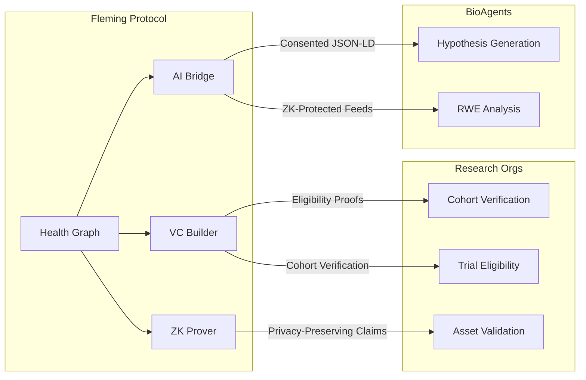
```mermaid
graph LR
    subgraph fleming [Fleming Protocol]
        Graph[Health Graph]
        VC[VC Builder]
        ZK[ZK Prover]
        Export[AI Bridge]
    end

    subgraph research [Research Orgs]
        Cohort[Cohort Verification]
        Trials[Trial Eligibility]
        Assets[Asset Validation]
    end

    subgraph agents [BioAgents]
        Hypothesis[Hypothesis Generation]
        RWE[RWE Analysis]
    end

    Graph --> VC
    Graph --> ZK
    Graph --> Export

    VC -->|Eligibility Proofs| Cohort
    VC -->|Cohort Verification| Trials
    ZK -->|Privacy-Preserving Claims| Assets

    Export -->|Consented JSON-LD| Hypothesis
    Export -->|ZK-Protected Feeds| RWE
```

### Proof Request SDK Interface

```go
// pkg/protocol/dao/sdk.go

type ProofRequest struct {
    ClaimType   string            // "BloodworkRange", "ProtocolAdherence"
    Parameters  map[string]any    // Claim-specific params
    RequesterID string            // Requester identifier
    Purpose     string            // "trial_eligibility", "cohort_research"
}

type ProofResponse struct {
    Valid       bool
    Credential  *SDJWT            // If SD-JWT proof
    ZKProof     *Groth16Proof     // If ZK proof
    Attestation *Attestation      // Provider cosign if present
}

// Request a proof from a user
func RequestProof(patientID string, req ProofRequest) (chan ProofResponse, error)

// Export graph data with consent
func ExportGraph(grantID string, format ExportFormat) (*ExportBundle, error)
```

### Integration Points

| Role                      | Integration           | Data Flow                           |
| :------------------------ | :-------------------- | :---------------------------------- |
| **Research org (trials)** | Trial eligibility     | SD-JWT proofs for biomarker ranges  |
| **BioAgent (RWE)**        | Hypothesis generation | JSON-LD graph exports via AI Bridge |
| **BioAgent (causal)**     | Causal analysis       | ZK-protected biomarker correlations |
| **Wearables**             | Data import           | FHIR-ish CSV/JSON ingestion         |
| **Labs**                  | Lab import            | Structured bloodwork ingestion      |

---

## 12. Architectural Principles

| Principle           | Meaning                                      | Anti-Pattern Avoided   |
| :------------------ | :------------------------------------------- | :--------------------- |
| **Protocol-First**  | Protocol defines truth; apps are interfaces  | Tight coupling         |
| **Backend-Blind**   | Server never sees plaintext or claim content | Server-side decryption |
| **Consent-First**   | Every access requires auditable grant        | Implicit access        |
| **Self-Sovereign**  | Users own keys and data                      | Centralized custody    |
| **Proof-Over-Data** | Prove claims, don't share raw data           | Over-disclosure        |
| **Auditable**       | Every action is logged and verifiable        | Silent operations      |
| **Portable**        | Data and proofs work anywhere                | Vendor lock-in         |

### Dependency Rule

```
Applications (apps/) --> Protocol (pkg/protocol/)
         OK                      OK

Protocol (pkg/protocol/) --> Applications (apps/)
              NEVER
```

---

## 13. Key Decisions (ADRs)

| Decision                         | Rationale                                  | Trade-off                            |
| :------------------------------- | :----------------------------------------- | :----------------------------------- |
| **Go Modular Monolith**          | Simple deployment, easy debugging          | Horizontal scaling needs refactoring |
| **SIWE (EIP-4361)**              | Passwordless, user-controlled identity     | Wallet UX unfamiliar to some         |
| **Client-Side Encryption**       | True zero-knowledge, server blind          | No server-side recovery              |
| **SD-JWT over W3C VC**           | Simpler, native selective disclosure       | Less ecosystem tooling               |
| **gnark over circom**            | Native Go, production-ready, single binary | Smaller circuit ecosystem            |
| **Base L2**                      | Cost-effective, Ethereum-aligned           | Not mainnet security                 |
| **Postgres JSONB + CTEs**        | Graph queries without dedicated graph DB   | Limited graph algorithms             |
| **Client-side OCR**              | Pre-encryption extraction, privacy         | Browser performance limits           |
| **Rule-based suggestions first** | No LLM dependency initially                | Less intelligent                     |

---

## 14. Folder Structure

```
fleming/
├── pkg/                          # PROTOCOL LAYER
│   └── protocol/
│       ├── identity/             # Wallet ownership, SIWE, DID
│       ├── timeline/             # Events, relationships, graph
│       ├── consent/              # State machine, grants
│       ├── crypto/               # Encryption interfaces
│       ├── audit/                # Event log, Merkle trees
│       ├── vc/                   # SD-JWT builder, claims, revocation
│       ├── attestation/          # Cosigning, provider attestations
│       ├── zk/                   # gnark circuits, prover, verifier
│       │   ├── circuits/         # Range, adherence, percentile
│       │   └── wasm/             # Browser bindings
│       ├── ai_bridge/            # Export serialization, BioAgents
│       └── types/                # Shared DTOs, coding systems
├── apps/                         # APPLICATION LAYER
│   ├── backend/                  # Go API (blind storage)
│   │   ├── cmd/fleming/
│   │   ├── internal/
│   │   │   ├── timeline/
│   │   │   ├── consent/
│   │   │   ├── audit/
│   │   │   ├── vc/               # VC metadata storage
│   │   │   └── export/
│   │   └── router.go
│   └── web/                      # React SPA
│       ├── src/
│       │   ├── features/
│       │   │   ├── timeline/
│       │   │   ├── consent/
│       │   │   ├── credentials/  # Proof wizard, QR
│       │   │   └── upload/       # OCR, guided metadata
│       │   └── lib/
│       │       ├── crypto/       # WebCrypto, KEK
│       │       ├── zk/           # gnark WASM
│       │       └── ocr/          # Tesseract.js
│       └── public/
│           └── verifier/         # Static verifier HTML+JS
├── contracts/                    # CHAIN LAYER (Solidity)
│   ├── FlemingAnchor.sol         # Merkle anchoring
│   ├── VCRegistry.sol            # Revocation, DID
│   └── ZKVerifier.sol            # Groth16 verification
├── docs/                         # Documentation
│   ├── ARCHITECTURE.md           # Architecture-only reference (this file)
└── compose.yml                   # Local development
```

---

## 15. Related Documents

- **Architecture Guide (for newcomers)**: [ARCHITECTURE_GUIDE.md](./ARCHITECTURE_GUIDE.md) — explanatory guide with ecosystem context
- **Development Roadmap**: [ROADMAP.md](./ROADMAP.md)
- **Data Model & Graph Logic**: [DATA_MODEL.md](./DATA_MODEL.md)
- **OWASP Frontend Rules**: [.cursor/rules/owasp_frontend.mdc](../.cursor/rules/owasp_frontend.mdc)
- **Go Coding Rules**: [.cursor/rules/go.mdc](../.cursor/rules/go.mdc)
