# Fleming — System Architecture

> **Guiding Principle**: *"The Protocol is the source of truth. Applications are interfaces to it."*

---

## 1. The Two-Layer Architecture

Fleming separates concerns into two distinct layers:

> **Context**: Fleming is a **Hybrid DeSci Application**. It combines the privacy and sovereignty of decentralized protocols with the performance and UX of centralized indexing. It is not a pure dApp (no logic lives on-chain), nor a Web2 app (the server has no custody). It is a **Protocol-First** application where the blockchain is used strictly for trust anchoring (verification), not for storage.

```mermaid
graph TB
    subgraph "🔬 PROTOCOL LAYER"
        direction TB
        Protocol["📜 Medical Data Protocol<br/>━━━━━━━━━━━━━━━━━━━━━━━<br/>• Identity & Ownership<br/>• Timeline Events<br/>• Consent Semantics<br/>• End-to-End Encryption<br/>• Audit Trail<br/>• ZK Attestations<br/>━━━━━━━━━━━━━━━━━━━━━━━<br/>pkg/protocol/"]
    end

    subgraph "📱 APPLICATION LAYER"
        direction LR
        Fleming["🏥 Fleming App<br/>━━━━━━━━━━━━<br/>Patient-Doctor<br/>Interaction<br/>(apps/)"]
        Future1["🔬 Research App<br/>━━━━━━━━━━━━<br/>DeSci Analytics<br/>(future)"]
        Future2["📲 Mobile App<br/>━━━━━━━━━━━━<br/>Patient Portal<br/>(future)"]
    end

    subgraph "⛓️ CHAIN LAYER"
        direction LR
        BaseL2["Base L2<br/>━━━━━━━━━━━━<br/>Merkle Anchoring<br/>(mandatory)"]
    end

    Protocol --> Fleming
    Protocol --> Future1
    Protocol --> Future2
    Protocol --> BaseL2

    style Protocol fill:#6366f1,color:#fff
    style Fleming fill:#22c55e,color:#fff
    style BaseL2 fill:#f59e0b,color:#000
```

| Layer           | Purpose                                                 | Location        | Who Uses It                                |
| :-------------- | :------------------------------------------------------ | :-------------- | :----------------------------------------- |
| **Protocol**    | Source of truth for medical data, consent, and audit    | `pkg/protocol/` | All applications                           |
| **Application** | User-facing interfaces built on the Protocol            | `apps/`         | End users (patients, doctors, researchers) |
| **Chain**       | Cryptographic anchoring for tamper-evidence (mandatory) | `contracts/`    | Protocol (not users directly)              |

---

## 2. The Product: Fleming Network

> **Vision**: *"The GitHub of Medical Data"* — Secure. Private. Collaborative.

Fleming is not just a database; it is a **trust network** where health data flows securely between patients, providers, and researchers.

### 2.1 Value Proposition

| For Who         | Value Prop      | The Old Way                                                 | The Fleming Way                                     |
| :-------------- | :-------------- | :---------------------------------------------------------- | :-------------------------------------------------- |
| **Patients**    | **Sovereignty** | Files scattered across portals, lost logins.                | One vault, forever. You hold the keys.              |
| **Doctors**     | **Zero Risk**   | Managing sensitive data = liability + compliance headaches. | Access data *without* custody. Blind storage.       |
| **Researchers** | **Quality**     | Data is fragmented, non-standard, and hard to verify.       | Verified, structured, and consented data.           |
| **Network**     | **Trust**       | "Trust us, we have logs."                                   | **Proof.** Anchored on-chain, verifiable by anyone. |

### 2.2 User Personas & Roles

A single **Wallet Address** is your identity. Your "Role" (Patient, Doctor, Researcher) is just a **Verifiable Credential (VC)** attached to that identity.

#### 🧑‍🦱 **The Custodian (Patient)**
- **Goal**: "Keep my history safe and share it when *I* want."
- **Key Actions**:
  - `Upload` records (encrypted).
  - `Approve` access requests.
  - `Revoke` access instantly.
  - `Prove` claims (ZK) without sharing data.

#### 👨‍⚕️ **The Expert (Doctor/Provider)**
- **Goal**: "Get the full picture quickly so I can treat the patient."
- **Key Actions**:
  - `Request` access to a timeline.
  - `View` decrypted history (only while authorized).
  - `Append` new findings.
  - **Interaction**: Does *not* store patient data on their own servers.

#### 🔬 **The Analyst (Researcher)**
- **Goal**: "Find patterns in population health."
- **Key Actions**:
  - `Query` anonymized/aggregated data (future feature).
  - `Request` specific cohorts for trials.
  - **Interaction**: Never sees PII. Works with ZK proofs and aggregated stats.

### 2.3 The Interaction Model

```mermaid
sequenceDiagram
    participant P as 🧑‍🦱 Patient
    participant D as 👨‍⚕️ Doctor
    participant N as 🕸️ Fleming Network
    participant C as ⛓️ Base L2

    Note over P,D: CONNECTION
    D->>P: "Share your history with me" (QR Code / Link)
    P->>N: "Grant READ access to Doctor (24 hours)"

    Note over D,N: TRANSPARENCY
    N->>C: Anchor: "P granted D access at Time T"
    
    Note over P,D: COLLABORATION
    D->>N: Fetch Timeline
    N-->>D: Decrypted Timeline (Authorized)
    D->>D: Analyze & Diagnose
    D->>N: Add "Diagnosis: Hypertension"

    Note over P,D: COMPLETION
    P->>N: "Revoke access" OR Time Expires
    N->>D: Access Denied (Keys rotated/dropped)
```

---

## 3. Why Go for DeSci

Go is uniquely suited for building self-sovereign medical infrastructure:

| Strength             | DeSci Application                                         |
| -------------------- | --------------------------------------------------------- |
| **Stdlib Crypto**    | Native AES-GCM, ECDSA, SHA-256 — no external dependencies |
| **gnark ZK Library** | Production-grade zero-knowledge proofs in pure Go         |
| **go-ethereum**      | First-class EVM interaction for on-chain anchoring        |
| **Goroutines**       | Streaming encryption without blocking                     |
| **Static Binary**    | Single container, air-gapped deployment possible          |
| **No Runtime**       | Minimal attack surface, HSM-friendly                      |

> [!NOTE]
> Go's crypto stdlib is FIPS-compliant capable. For maximum privacy, we avoid CGO dependencies entirely.

---

## 4. The Protocol: Foundation for Medical Data

> *"A communication and tracking standard that guarantees accurate, safe, and auditable medical data."*

### 4.1 Protocol Components


### 4.2 Protocol Capabilities

| Capability   | Description                                        | Actors               |
| :----------- | :------------------------------------------------- | :------------------- |
| **Own**      | Individuals privately own their medical background | Patients             |
| **Control**  | Control who can access and who can upload          | Patients             |
| **Generate** | Doctors and researchers can create medical data    | Doctors, Researchers |
| **Upload**   | Upload data to individuals with their consent      | Doctors, Labs        |
| **Share**    | Selectively share data with care providers         | Patients             |
| **Prove**    | ZK proofs for claims without revealing data        | Patients             |
| **Audit**    | Every access and modification is tracked           | All                  |

### 4.3 Protocol Directory Structure

```
pkg/protocol/
├── identity/           # Wallet ownership, SIWE verification
├── timeline/           # Event types, relationships, graph
├── consent/            # State machine, permissions
├── crypto/             # Encryption interfaces, key derivation
├── audit/              # Event log, merkle trees, integrity proofs
├── zk/                 # gnark circuits for attestations
└── types/              # Shared DTOs, enums, validation
```

---

## 5. End-to-End Encryption (E2EE)

> **Core Principle**: The server NEVER sees plaintext. Only the patient can decrypt their data.

### 5.1 Encryption Model

```mermaid
sequenceDiagram
    participant Patient as 🧑‍🦱 Patient Browser
    participant Wallet as 🦊 Wallet
    participant Backend as 🖥️ Go Backend
    participant Storage as 📦 BlobStore

    Note over Patient,Storage: KEY DERIVATION (One-time)
    Patient->>Wallet: Sign("Fleming Key Derivation")
    Wallet-->>Patient: signature
    Patient->>Patient: KEK = HKDF(signature)

    Note over Patient,Storage: FILE ENCRYPTION
    Patient->>Patient: DEK = random AES-256 key
    Patient->>Patient: ciphertext = AES-GCM(file, DEK)
    Patient->>Patient: wrappedDEK = AES-GCM(DEK, KEK)

    Note over Patient,Storage: UPLOAD (Backend is blind)
    Patient->>Backend: { ciphertext, wrappedDEK, metadata }
    Backend->>Storage: Store(ciphertext) → CID
    Backend->>Backend: Store metadata + CID
    Backend-->>Patient: ✓ Stored

    Note over Patient,Storage: DECRYPTION (Client-only)
    Patient->>Backend: Request file by CID
    Backend->>Storage: Get(CID)
    Storage-->>Backend: ciphertext
    Backend-->>Patient: ciphertext + wrappedDEK
    Patient->>Patient: DEK = unwrap(wrappedDEK, KEK)
    Patient->>Patient: plaintext = decrypt(ciphertext, DEK)
```

### 5.2 Key Hierarchy

```
┌─────────────────────────────────────────────────────────────┐
│ WALLET PRIVATE KEY (never leaves wallet)                    │
│   └── Signs deterministic message                           │
│         └── Signature (never stored)                        │
│               └── HKDF derivation                           │
│                     └── KEK (Key Encryption Key)            │
│                           └── In-memory only                │
│                                 └── Wraps per-file DEKs     │
└─────────────────────────────────────────────────────────────┘
```

| Key                | Where It Lives           | Who Has It                 |
| ------------------ | ------------------------ | -------------------------- |
| Wallet Private Key | Hardware/software wallet | Patient only               |
| KEK                | Browser memory           | Patient only               |
| Wrapped DEK        | Postgres (encrypted)     | Backend (but can't unwrap) |
| DEK (plaintext)    | Browser memory (temp)    | Patient only               |

### 5.3 Recovery Model

> [!CAUTION]
> **No Server Recovery**: If a patient loses wallet access, their data is unrecoverable. This is intentional — true self-sovereignty.

**Mitigation Options** (user's choice):
- Export encrypted vault to personal storage
- Social recovery (future: Shamir secret sharing)
- Hardware wallet backup seed phrase

---

## 6. Zero-Knowledge Proofs (ZK)

> **Purpose**: Prove claims about medical data without revealing the data itself.

### 6.1 Use Cases

| Proof                 | What's Proven                  | What's Hidden        |
| --------------------- | ------------------------------ | -------------------- |
| Age Verification      | "I am over 18"                 | Actual birthdate     |
| Vaccination Status    | "I have required vaccines"     | Which vaccines, when |
| Condition Attestation | "I have been diagnosed with X" | Full medical history |
| Insurance Eligibility | "I meet coverage criteria"     | Sensitive details    |

### 6.2 Technical Implementation

```mermaid
graph LR
    subgraph "Client (Browser)"
        Data[Medical Data]
        Circuit[gnark Circuit]
        Proof[ZK Proof]
        Data --> Circuit
        Circuit --> Proof
    end

    subgraph "Verifier (Anyone)"
        Verify[Verify Proof]
        Result[✓ Valid / ✗ Invalid]
        Proof --> Verify
        Verify --> Result
    end

    subgraph "On-Chain (Optional)"
        Contract[Verifier Contract]
        Proof --> Contract
    end

    style Circuit fill:#6366f1,color:#fff
```

**Technology Stack**:
- **gnark** (Go): Circuit construction and proof generation
- **Groth16**: Proof system (small proofs, fast verification)
- **BN254**: Elliptic curve (Ethereum-compatible)

### 6.3 What ZK is NOT Used For

- ❌ General computation on encrypted data (homomorphic encryption)
- ❌ Private smart contracts
- ❌ Anonymous medical records

---

## 7. Smart Contracts (Solidity)

> **Chain**: Base L2 (Coinbase) — Ethereum-aligned, low cost, growing DeSci community.

**Mandatory Requirement**: All audit logs must be anchored on-chain. This provides the "trustless" guarantee that separates Fleming from a standard database.

### 7.1 Contract Architecture

```mermaid
graph TB
    subgraph "Base L2"
        Anchor[FlemingAnchor.sol<br/>━━━━━━━━━━━━━━━<br/>Merkle root storage<br/>Timestamp proofs]
        DID[FlemingDID.sol<br/>━━━━━━━━━━━━━━━<br/>Optional DID registry<br/>Post-MVP]
        ZKVerifier[ZKVerifier.sol<br/>━━━━━━━━━━━━━━━<br/>Groth16 verification<br/>Post-MVP]
    end

    subgraph "Go Backend"
        AuditLog[Audit Log]
        MerkleTree[Merkle Tree]
        EthClient[go-ethereum]
    end

    AuditLog --> MerkleTree
    MerkleTree --> EthClient
    EthClient --> Anchor

    style Anchor fill:#22c55e,color:#fff
    style DID fill:#94a3b8,color:#000
    style ZKVerifier fill:#94a3b8,color:#000
```

### 7.2 On-Chain vs Off-Chain

| Data             | Location               | Rationale             |
| ---------------- | ---------------------- | --------------------- |
| Patient records  | ❌ Off-chain            | Privacy, cost, size   |
| Consent grants   | ❌ Off-chain            | Frequent updates      |
| Audit entries    | ❌ Off-chain            | Volume                |
| **Merkle roots** | ✅ On-chain (Mandatory) | Tamper-evidence       |
| **DID anchors**  | ✅ On-chain (Optional)  | Identity verification |
| **ZK proofs**    | ✅ On-chain (Optional)  | Public attestations   |

### 7.3 FlemingAnchor.sol

```solidity
// SPDX-License-Identifier: MIT
pragma solidity ^0.8.20;

contract FlemingAnchor {
    event AuditRootAnchored(
        bytes32 indexed root,
        uint256 indexed blockNumber,
        uint256 timestamp
    );

    mapping(bytes32 => uint256) public anchors;

    function anchor(bytes32 merkleRoot) external {
        require(anchors[merkleRoot] == 0, "Already anchored");
        anchors[merkleRoot] = block.timestamp;
        emit AuditRootAnchored(merkleRoot, block.number, block.timestamp);
    }

    function verify(bytes32 merkleRoot) external view returns (uint256) {
        return anchors[merkleRoot];
    }
}
```

### 7.4 Gas & Cost

| Operation          | Gas      | Cost (Base L2) |
| ------------------ | -------- | -------------- |
| Anchor merkle root | ~50,000  | ~$0.001        |
| Daily batch        | 1 tx/day | ~$0.03/month   |
| DID registration   | ~100,000 | ~$0.002        |

---

## 8. Fleming Application: Patient-Doctor Interaction

> *"Fleming is the first application built on the Protocol, focused on the patient-doctor relationship."*

### 8.1 Fleming's Scope

```mermaid
graph LR
    subgraph "Fleming App Scope"
        direction TB
        P[("🧑‍🦱 Patient")]
        D[("👨‍⚕️ Doctor")]

        P -->|"Owns timeline"| T["📋 Medical Timeline"]
        P -->|"Grants consent"| C["✅ Consent"]
        D -->|"Requests access"| C
        D -->|"Uploads data"| T
        P -->|"Views history"| T
        P -->|"Exports vault"| E["📦 Data Export"]
    end
```

| Feature               | Description                          | Protocol Component Used |
| :-------------------- | :----------------------------------- | :---------------------- |
| Medical Timeline      | Chronological + graph view of events | `protocol/timeline`     |
| E2E Encrypted Upload  | Browser encrypts, server blind       | `protocol/crypto`       |
| Consent Management    | Request, approve, revoke access      | `protocol/consent`      |
| Wallet Authentication | SIWE login                           | `protocol/identity`     |
| Audit Log             | Who accessed what, when              | `protocol/audit`        |
| Data Export           | Download personal vault              | New feature             |

### 8.2 What Fleming Does NOT Do (MVP)

- **Research aggregation** — Future app
- **Multi-provider networks** — Future feature
- **Insurance claims processing** — Out of scope
- **Clinical decision support** — Out of scope
- **Server-side decryption** — Never

---

## 9. Architectural Principles

### 9.1 Core Principles

| Principle          | Meaning                                     | Anti-Pattern Avoided   |
| :----------------- | :------------------------------------------ | :--------------------- |
| **Protocol-First** | Protocol defines truth; apps are interfaces | Tight coupling         |
| **Consent-First**  | Every data access requires auditable grant  | Implicit access        |
| **Self-Sovereign** | Users own keys and data                     | Centralized custody    |
| **Zero-Knowledge** | Server cannot read patient data             | Server-side decryption |
| **Auditable**      | Every action is logged and verifiable       | Silent operations      |
| **Self-Hostable**  | Docker Compose deployment                   | Cloud lock-in          |

### 9.2 Dependency Rule

```
Applications (apps/) → Protocol (pkg/protocol/)
           ✅                    ✅

Protocol (pkg/protocol/) → Applications (apps/)
           ❌ NEVER
```

### 9.3 Non-Goals (MVP Scope)

- **Event Sourcing / CQRS**: Append-preferred, not full event-sourced
- **Multi-Region Replication**: Single-node Postgres sufficient
- **Server-Side Decryption**: Never — E2EE only
- **Complex ACL Engine**: ABAC sufficient, no OPA/Rego
- **Native FHIR Storage**: Use Anti-Corruption Layer (ACL) pattern
- **Homomorphic Encryption**: ZK for attestations, not computation

---

## 10. System Context

```mermaid
graph TB
    subgraph Actors
        Patient((🧑‍🦱 Patient))
        Doctor((👨‍⚕️ Doctor))
        Researcher((🔬 Researcher))
    end

    subgraph "Protocol Layer"
        Protocol[("📜 Medical Data Protocol<br/>━━━━━━━━━━━━━━━━━━━━<br/>Source of Truth")]
    end

    subgraph "Application Layer"
        Fleming["🏥 Fleming"]
    end

    subgraph External
        Wallet["🦊 Wallet<br/>(Key custody)"]
        Chain["⛓️ Base L2<br/>(Proof anchoring)"]
    end

    Patient -->|"Owns data + keys"| Protocol
    Doctor -->|"Generates data"| Protocol
    Researcher -->|"Queries aggregated"| Protocol

    Protocol --> Fleming

    Patient -->|"Uses"| Fleming
    Doctor -->|"Uses"| Fleming

    Patient <-->|"Signs + derives keys"| Wallet
    Protocol -->|"Anchors proofs"| Chain

    style Protocol fill:#6366f1,color:#fff
    style Fleming fill:#22c55e,color:#fff
    style Chain fill:#f59e0b,color:#000
```

---

## 11. Container Diagram

```mermaid
graph TD
    subgraph "Client Layer"
        Browser["🌐 Web Browser<br/>━━━━━━━━━━━━<br/>• WebCrypto encryption<br/>• Wallet interaction<br/>• ZK proof generation"]
    end

    subgraph "Application Layer (apps/)"
        WebApp["Web App<br/>(React + Vite)"]
        Backend["Backend API<br/>(Go Monolith)<br/>━━━━━━━━━━━━<br/>Blind to plaintext"]
    end

    subgraph "Protocol Layer (pkg/)"
        ProtocolLib["Protocol Library<br/>━━━━━━━━━━━━━<br/>Identity, Timeline,<br/>Consent, Audit,<br/>ZK Circuits"]
    end

    subgraph "Data Layer"
        DB[("PostgreSQL<br/>━━━━━━━━━━━━<br/>Metadata + wrapped keys")]
        ObjectStore[("BlobStore<br/>━━━━━━━━━━━━<br/>Encrypted blobs only")]
    end

    subgraph "Chain Layer"
        BaseL2["Base L2<br/>━━━━━━━━━━━━<br/>Mandatory Merkle roots"]
    end

    Browser --> WebApp
    WebApp -->|REST/JSON| Backend
    Backend --> ProtocolLib
    Backend --> DB
    Backend --> ObjectStore
    Backend -->|Daily cron| BaseL2

    style ProtocolLib fill:#6366f1,color:#fff
    style Browser fill:#22c55e,color:#fff
    style BaseL2 fill:#f59e0b,color:#000
```

---

## 12. Data Flows

### 12.1 Patient Uploads Medical Record (E2EE)

```mermaid
sequenceDiagram
    participant Patient as 🧑‍🦱 Patient
    participant Browser as 🌐 Browser
    participant Backend as 🖥️ Backend
    participant Storage as 📦 BlobStore

    Patient->>Browser: Select file
    Browser->>Browser: Generate DEK (random)
    Browser->>Browser: Encrypt file (AES-256-GCM)
    Browser->>Browser: Wrap DEK with KEK
    Browser->>Backend: Upload { ciphertext, wrappedDEK }
    Note over Backend: ⚠️ Backend CANNOT decrypt
    Backend->>Storage: Store(ciphertext) → CID
    Backend->>Backend: Store metadata + CID + wrappedDEK
    Backend->>Backend: Append audit entry
    Backend-->>Patient: ✓ Success
```

### 12.2 Doctor Requests Access

```mermaid
sequenceDiagram
    participant Doctor as 👨‍⚕️ Doctor
    participant Fleming as 🏥 Fleming App
    participant Protocol as 📜 Protocol
    participant Patient as 🧑‍🦱 Patient

    Doctor->>Fleming: Request access to timeline
    Fleming->>Protocol: Create consent request
    Protocol-->>Patient: Notification
    Patient->>Fleming: Review & approve
    Fleming->>Protocol: Transition consent state
    Protocol->>Protocol: Log to audit trail
    Note over Patient: Patient shares re-encrypted DEKs
    Protocol-->>Doctor: Access granted (time-limited)
```

### 12.3 Consent State Machine


---

## 13. Key Decisions (ADRs)

| Decision                   | Rationale                              | Trade-off                            |
| :------------------------- | :------------------------------------- | :----------------------------------- |
| **Go Modular Monolith**    | Simple deployment, easy debugging      | Horizontal scaling needs refactoring |
| **SIWE (EIP-4361)**        | Passwordless, user-controlled identity | Wallet UX unfamiliar to some         |
| **Client-Side Encryption** | True zero-knowledge, server blind      | No server-side recovery              |
| **Base L2 Anchoring**      | Cost-effective, Ethereum-aligned       | Not mainnet security                 |
| **gnark for ZK**           | Native Go, production-ready            | Steeper learning curve than circuits |
| **Postgres for Graphs**    | JSONB + CTEs, strong ACID              | Not dedicated graph DB               |
| **Append-Only Graph**      | Full auditability, "time-travel"       | UX complexity (filtering history)    |
| **Docker Compose**         | Single-command deployment              | Manual scaling                       |

---

## 14. Security Model

| Layer              | Mechanism                          | Threat Mitigated            |
| :----------------- | :--------------------------------- | :-------------------------- |
| **Transport**      | HTTPS (TLS 1.3)                    | Eavesdropping, MITM         |
| **Authentication** | SIWE + JWT (short TTL)             | Credential theft            |
| **Authorization**  | Consent Engine (ABAC)              | Unauthorized access         |
| **Data at Rest**   | AES-256-GCM (client-side)          | Database breach, insider    |
| **Key Custody**    | User wallet only                   | Server compromise           |
| **Audit**          | Hash-chained log + on-chain anchor | Tampering                   |
| **Attestations**   | ZK proofs (Groth16)                | Unnecessary data disclosure |

---

## 15. Folder Structure

```text
fleming/
├── pkg/                      # 🔬 PROTOCOL LAYER
│   └── protocol/
│       ├── identity/         # Wallet ownership, SIWE
│       ├── timeline/         # Events, relationships
│       ├── consent/          # State machine
│       ├── crypto/           # Encryption interfaces
│       ├── audit/            # Event log, merkle trees
│       ├── zk/               # gnark circuits (future)
│       └── types/            # Shared DTOs
├── apps/                     # 📱 APPLICATION LAYER
│   ├── backend/              # Go API (blind storage)
│   │   ├── cmd/fleming/
│   │   ├── internal/
│   │   └── router.go
│   └── web/                  # React SPA (encryption here)
├── contracts/                # ⛓️ CHAIN LAYER (Solidity)
│   ├── FlemingAnchor.sol
│   ├── FlemingDID.sol
│   └── ZKVerifier.sol
├── docs/                     # Architecture, roadmap
└── compose.yml               # Deployment
```

---

## 16. The Information Cycle

How data flows through Fleming's three layers:

```
┌─────────────────────────────────────────────────────────────────────┐
│                        FLEMING STACK                                │
├─────────────────────────────────────────────────────────────────────┤
│                                                                     │
│  ┌─────────────────────────────────────────────────────────────┐   │
│  │  LAYER 3: CHAIN (Mandatory Anchoring)                       │   │
│  │  • Merkle root proofs only — zero patient data              │   │
│  │  • Proves "this audit log existed at time T"                │   │
│  │  • Base L2 (Coinbase)                                       │   │
│  └─────────────────────────────────────────────────────────────┘   │
│                              │ anchors                              │
│                              ▼                                      │
│  ┌─────────────────────────────────────────────────────────────┐   │
│  │  LAYER 2: APPLICATION (Blind Storage)                       │   │
│  │  • Postgres: Metadata, wrapped DEKs, consent, audit         │   │
│  │  • BlobStore: Encrypted blobs (server cannot decrypt)       │   │
│  │  • Go backend: Storage + graph queries only                 │   │
│  └─────────────────────────────────────────────────────────────┘   │
│                              │ governed by                          │
│                              ▼                                      │
│  ┌─────────────────────────────────────────────────────────────┐   │
│  │  LAYER 1: PROTOCOL (Semantics & Rules)                      │   │
│  │  • Pure Go library (pkg/protocol/)                          │   │
│  │  • Validates WHAT can be stored and WHO can access          │   │
│  │  • Defines encryption interfaces (implemented in browser)   │   │
│  └─────────────────────────────────────────────────────────────┘   │
│                                                                     │
└─────────────────────────────────────────────────────────────────────┘
```

---

## 17. Swappable Permanence Layer (DeSci-Ready)

Fleming uses a **BlobStore interface** that abstracts the storage backend:

```
┌─────────────────────────────────────────────────────────────────┐
│                 PERMANENCE LAYER ABSTRACTION                    │
├─────────────────────────────────────────────────────────────────┤
│                                                                 │
│    ┌─────────────────────────────────────────────────────────┐  │
│    │  BlobStore Interface                                    │  │
│    │  • Put(ctx, data) → CID                                 │  │
│    │  • Get(ctx, cid) → data                                 │  │
│    │  • Delete(ctx, cid) → error                             │  │
│    └─────────────────────────────────────────────────────────┘  │
│                              │                                  │
│              ┌───────────────┼───────────────┐                  │
│              ▼               ▼               ▼                  │
│    ┌─────────────┐   ┌─────────────┐   ┌─────────────┐         │
│    │  MinIO      │   │  IPFS       │   │  Arweave    │         │
│    │  (MVP)      │   │  (Post-MVP) │   │  (Future)   │         │
│    └─────────────┘   └─────────────┘   └─────────────┘         │
│                                                                 │
└─────────────────────────────────────────────────────────────────┘
```

| Phase    | Backend             | Cost          | Notes                 |
| -------- | ------------------- | ------------- | --------------------- |
| MVP      | MinIO (self-hosted) | $0            | CIDs computed locally |
| Post-MVP | IPFS (web3.storage) | $0 (5GB free) | Decentralized backup  |
| Future   | Arweave             | ~$5/GB        | Permanent storage     |

---

## 18. Future: Protocol Ecosystem

```mermaid
graph LR
    Protocol["📜 Protocol"]

    Protocol --> Fleming["🏥 Fleming<br/>Patient-Doctor"]
    Protocol --> Research["🔬 Research App<br/>DeSci Analytics"]
    Protocol --> Mobile["📲 Mobile App<br/>Patient Portal"]
    Protocol --> Lab["🧪 Lab Integration<br/>Auto-upload results"]
    Protocol --> Insurance["🏢 Insurance<br/>Claims (future)"]

    style Protocol fill:#6366f1,color:#fff
```

---

## 19. Related Documents

- **Development Roadmap**: [ROADMAP.md](./ROADMAP.md)
- **Data Model & Graph Logic**: [DATA_MODEL.md](./DATA_MODEL.md)
- **OWASP Frontend Rules**: [.agent/rules/owasp_frontend.md](../.agent/rules/owasp_frontend.md)
- **Go Coding Rules**: [.agent/rules/go.md](../.agent/rules/go.md)
