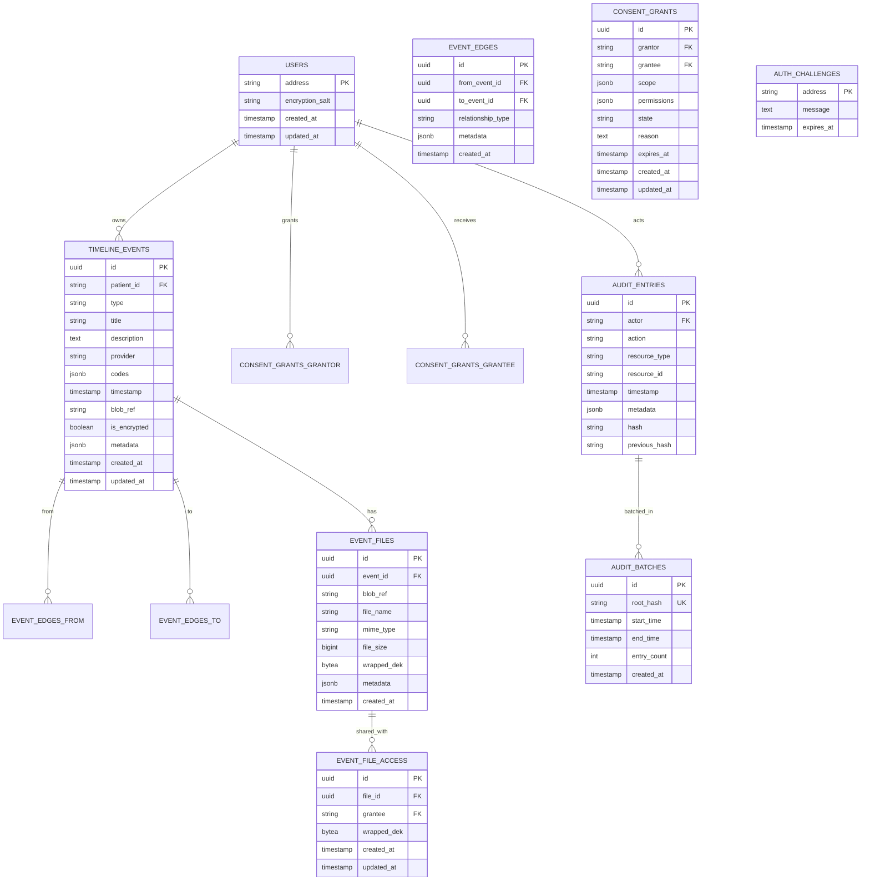

# Fleming Codebase Digestion Guide

> **Complete walkthrough of the Fleming project structure, architecture, implementation, and workflows**

---

## Table of Contents

1. [Executive Summary](#executive-summary)
2. [Project Structure Deep Dive](#project-structure-deep-dive)
3. [Architecture Layers](#architecture-layers)
4. [Protocol Layer (`pkg/protocol/`)](#protocol-layer-pkgprotocol)
5. [Application Layer - Backend (`apps/backend/`)](#application-layer-backend-appsbackend)
6. [Application Layer - Frontend (`apps/web/`)](#application-layer-frontend-appsweb)
7. [Infrastructure & Deployment](#infrastructure--deployment)
8. [Data Flow Diagrams](#data-flow-diagrams)
9. [Key Workflows](#key-workflows)
10. [Security Architecture](#security-architecture)
11. [Testing Strategy](#testing-strategy)
12. [File Dependency Graph](#file-dependency-graph)
13. [Database Schema](#database-schema)
14. [How-To Guides](#how-to-guides)

---

## Executive Summary

### Project Purpose and Vision

**Fleming** is a production-grade DeSci (Decentralized Science) product and protocol that gives individuals full control over their medical history while enabling privacy-preserving, verifiable scientific research.

**Core Value Proposition:**
- **For Patients**: Own your complete medical timeline in one secure vault
- **For Doctors**: Access patient data without custody liability
- **For Researchers**: Verified, structured, consented data for studies
- **For the Network**: Cryptographic proof of all access and modifications

### Core Principles

1. **User Sovereignty**: The patient owns the data, not the platform
2. **Explicit Consent**: Every access is approved, scoped, and auditable
3. **Privacy by Design**: All sensitive data is encrypted; the server cannot read it
4. **Honest Architecture**: Storage is centralized by default, power is not
5. **Science without Extraction**: Research participation is voluntary and verifiable

### Technology Stack Overview

| Layer | Technology | Purpose |
|-------|-----------|---------|
| **Frontend** | React 19 + TypeScript + Vite (Rolldown) | User interface with client-side encryption |
| **Backend** | Go 1.25 (Modular Monolith) | API server, blind storage, graph queries |
| **Database** | PostgreSQL | Metadata, wrapped keys, consent, audit logs |
| **Storage** | MinIO (S3-compatible) | Encrypted blob storage |
| **Blockchain** | Base L2 (Solidity) | Merkle root anchoring (mandatory) |
| **Authentication** | SIWE (EIP-4361) | Wallet-based passwordless auth |
| **Encryption** | AES-256-GCM + AES-KW | End-to-end encryption (E2EE) |
| **Deployment** | Docker Compose | Self-hostable single-command deployment |

### Key Architectural Decisions

1. **Protocol-First Architecture**: `pkg/protocol/` is the source of truth; applications depend on it, never the reverse
2. **Modular Monolith**: Simple deployment, easy debugging, can refactor to microservices if needed
3. **Client-Side Encryption**: True zero-knowledge; server never sees plaintext
4. **Append-Only Graph**: Full auditability with "time-travel" capability
5. **Consent State Machine**: Explicit, auditable access control
6. **Hash-Chained Audit Log**: Cryptographic integrity with Merkle tree anchoring

---

## Project Structure Deep Dive

### Complete File Tree

```
fleming/
├── .cursor/                          # Cursor IDE configuration
│   └── rules/                        # Project-specific coding rules
│       ├── architecture.mdc         # Architecture decisions and patterns
│       ├── front.mdc                 # React/TypeScript frontend rules
│       ├── general.mdc               # Core project directives
│       └── go.mdc                    # Go backend coding standards
│
├── apps/                             # APPLICATION LAYER
│   ├── backend/                      # Go API Server (Modular Monolith)
│   │   ├── cmd/
│   │   │   ├── fleming/
│   │   │   │   └── main.go          # Application entry point
│   │   │   └── seed/
│   │   │       └── main.go          # Database seeding utility
│   │   ├── internal/                # Private application code
│   │   │   ├── auth/                # Authentication module
│   │   │   │   ├── entity.go       # User and Challenge models
│   │   │   │   ├── handler.go      # HTTP handlers
│   │   │   │   ├── repository.go   # Data access layer
│   │   │   │   ├── routes.go       # Route registration
│   │   │   │   ├── service.go      # Business logic
│   │   │   │   └── service_test.go # Unit tests
│   │   │   ├── timeline/           # Timeline management module
│   │   │   │   ├── entity.go       # Event, Edge, File models
│   │   │   │   ├── handler.go      # HTTP handlers (large, handles multipart)
│   │   │   │   ├── repository.go   # Graph queries, CRUD operations
│   │   │   │   ├── routes.go       # Route registration
│   │   │   │   ├── service.go      # Business logic (append-only corrections)
│   │   │   │   └── service_test.go # Unit tests
│   │   │   ├── consent/            # Consent management module
│   │   │   │   ├── entity.go       # ConsentGrant model
│   │   │   │   ├── handler.go      # HTTP handlers
│   │   │   │   ├── repository.go   # Data access layer
│   │   │   │   └── service.go      # State machine logic
│   │   │   ├── audit/              # Audit logging module
│   │   │   │   ├── batch.go        # AuditBatch model
│   │   │   │   ├── entity.go       # AuditEntry model
│   │   │   │   ├── handler.go      # HTTP handlers
│   │   │   │   ├── repository.go   # Query interface
│   │   │   │   └── service.go      # Hash chaining, Merkle trees
│   │   │   ├── storage/            # Blob storage abstraction
│   │   │   │   ├── storage.go      # Storage interface
│   │   │   │   └── minio.go        # MinIO implementation
│   │   │   ├── middleware/         # HTTP middleware
│   │   │   │   └── middleware.go   # Auth + Consent enforcement
│   │   │   └── common/             # Shared utilities
│   │   │       ├── types.go        # JSON serialization helpers
│   │   │       └── utils.go        # Hex conversion utilities
│   │   ├── router.go                # Main router setup
│   │   ├── Dockerfile               # Multi-stage build
│   │   ├── go.mod                   # Go dependencies
│   │   └── go.sum                   # Dependency checksums
│   │
│   └── web/                         # React SPA (Frontend)
│       ├── src/
│       │   ├── components/          # Reusable UI components
│       │   │   ├── common/          # Shared components
│       │   │   │   ├── app-navigation.tsx
│       │   │   │   ├── address-display.tsx
│       │   │   │   ├── confirmation-modal.tsx
│       │   │   │   ├── loading-screen.tsx
│       │   │   │   ├── logo.tsx
│       │   │   │   ├── theme-toggle.tsx
│       │   │   │   └── vault-unlock-dialog.tsx
│       │   │   └── ui/              # shadcn/ui primitives
│       │   │       ├── avatar.tsx
│       │   │       ├── badge.tsx
│       │   │       ├── button.tsx
│       │   │       ├── card.tsx
│       │   │       ├── dialog.tsx
│       │   │       ├── input.tsx
│       │   │       ├── label.tsx
│       │   │       ├── select.tsx
│       │   │       ├── separator.tsx
│       │   │       ├── sheet.tsx
│       │   │       ├── skeleton.tsx
│       │   │       ├── tabs.tsx
│       │   │       └── tooltip.tsx
│       │   ├── features/            # Feature-based organization
│       │   │   ├── auth/            # Authentication feature
│       │   │   │   ├── api/         # API client functions
│       │   │   │   ├── components/  # Auth UI components
│       │   │   │   ├── context/     # Auth context provider
│       │   │   │   ├── contexts/   # Vault context provider
│       │   │   │   ├── hooks/       # useAuth hook
│       │   │   │   └── types/       # TypeScript types
│       │   │   ├── timeline/       # Timeline feature
│       │   │   │   ├── api/         # Timeline API calls
│       │   │   │   ├── components/ # Timeline UI components
│       │   │   │   ├── hooks/       # useTimeline, useUpload
│       │   │   │   ├── pages/      # Page components
│       │   │   │   ├── stores/     # Zustand state management
│       │   │   │   └── types/      # TypeScript types
│       │   │   ├── consent/         # Consent feature
│       │   │   │   ├── api/         # Consent API calls
│       │   │   │   ├── components/  # Consent UI (wizard, cards)
│       │   │   │   ├── hooks/       # Consent hooks
│       │   │   │   ├── pages/       # Consent page
│       │   │   │   └── types/       # TypeScript types
│       │   │   ├── audit/           # Audit feature
│       │   │   │   ├── api/         # Audit API calls
│       │   │   │   ├── components/  # Audit log viewer
│       │   │   │   ├── pages/       # Audit page
│       │   │   │   └── types/       # TypeScript types
│       │   │   └── landing/         # Landing page feature
│       │   │       ├── components/
│       │   │       └── pages/
│       │   ├── lib/                 # Shared libraries
│       │   │   ├── api-client.ts   # HTTP client wrapper
│       │   │   ├── cookie-utils.ts # Cookie helpers
│       │   │   ├── crypto/          # Client-side encryption
│       │   │   │   ├── encryption.ts # AES-GCM encryption
│       │   │   │   └── keys.ts       # Key derivation (HKDF)
│       │   │   ├── utils.ts         # Utility functions
│       │   │   └── wagmi.ts         # Wagmi config
│       │   ├── routes/              # TanStack Router routes
│       │   │   ├── __root.tsx       # Root layout
│       │   │   ├── index.tsx        # Home route
│       │   │   ├── audit.tsx        # Audit route
│       │   │   ├── consent.tsx      # Consent route
│       │   │   └── routeTree.gen.ts # Generated route tree
│       │   ├── hooks/               # Global hooks
│       │   │   └── use-theme.ts     # Theme management
│       │   ├── types/               # Global types
│       │   │   └── ethereum.ts      # Ethereum types
│       │   ├── main.tsx             # Application entry
│       │   └── index.css            # Global styles
│       ├── Dockerfile               # Multi-stage build
│       ├── package.json             # npm dependencies
│       ├── vite.config.ts           # Vite configuration
│       └── tsconfig.json            # TypeScript config
│
├── pkg/                              # PROTOCOL LAYER (Source of Truth)
│   └── protocol/                     # Core domain logic (pure Go)
│       ├── identity/                 # Wallet-based identity
│       │   ├── siwe.go               # SIWE message building
│       │   ├── siwe_test.go          # SIWE tests
│       │   └── verify.go             # Signature verification
│       ├── timeline/                 # Timeline events and relationships
│       │   ├── event.go              # Event types and validation
│       │   ├── event_test.go         # Event tests
│       │   ├── relationship.go       # Relationship types and edges
│       │   ├── relationship_test.go  # Relationship tests
│       │   └── graph.go              # Graph interface
│       ├── consent/                  # Consent state machine
│       │   ├── grant.go              # Consent grant model
│       │   ├── grant_test.go         # Grant tests
│       │   ├── state.go              # State machine logic
│       │   └── state_test.go        # State machine tests
│       ├── audit/                    # Audit logging and Merkle trees
│       │   ├── entry.go              # Audit entry model
│       │   ├── entry_test.go         # Entry tests
│       │   ├── log.go                # Log interface
│       │   ├── merkle.go             # Merkle tree implementation
│       │   └── merkle_test.go        # Merkle tree tests
│       ├── crypto/                   # Cryptographic utilities
│       │   └── signature.go          # ECDSA signature verification
│       └── types/                    # Core types and validation
│           ├── types.go              # ID, WalletAddress, Metadata, Timestamp
│           ├── types_test.go         # Type tests
│           ├── principal.go         # Principal (actor) types
│           ├── coding.go             # Medical coding (ICD-10, LOINC)
│           ├── coding_test.go        # Coding tests
│           └── errors.go             # Validation errors
│
├── docs/                             # Documentation
│   ├── ARCHITECTURE.md               # High-level architecture
│   └── CODEBASE_GUIDE.md             # This file
│
├── compose.yml                       # Docker Compose services
├── compose.override.yml               # Development overrides
├── .env.example                      # Environment template
├── .gitignore                        # Git ignore rules
├── .dockerignore                     # Docker ignore rules
├── go.work.sum                       # Go workspace checksums
└── README.md                         # Project README
```

### Directory Organization Rationale

#### Protocol Layer (`pkg/protocol/`)

**Purpose**: Pure domain logic with zero dependencies on application code. This is the "source of truth" for all medical data semantics.

**Organization**:
- Each package (`identity`, `timeline`, `consent`, `audit`, `crypto`, `types`) is self-contained
- No circular dependencies
- All types are validated with explicit error handling
- Test files co-located with implementation

**Key Files**:
- `types/types.go`: Foundation types (ID, WalletAddress, Metadata, Timestamp)
- `timeline/event.go`: 14 event types (consultation, diagnosis, lab_result, etc.)
- `consent/state.go`: 5-state machine (requested → approved/denied → revoked/expired)
- `audit/merkle.go`: Merkle tree construction and proof generation

#### Backend Application (`apps/backend/`)

**Purpose**: HTTP API server implementing the protocol. Uses modular monolith pattern.

**Organization**:
- `cmd/fleming/main.go`: Entry point, dependency injection, server startup
- `internal/`: Private application code (not importable outside)
  - Each module (`auth`, `timeline`, `consent`, `audit`) follows DDD pattern:
    - `entity.go`: Database models (GORM)
    - `repository.go`: Data access interface + GORM implementation
    - `service.go`: Business logic (depends on repository interface)
    - `handler.go`: HTTP handlers (depends on service)
    - `routes.go`: Route registration
- `router.go`: Main router setup, middleware wiring

**Key Patterns**:
- Repository pattern: Services depend on interfaces, not concrete DB
- Dependency injection: All dependencies passed via constructors
- Middleware chain: Auth → Consent → Handler

#### Frontend Application (`apps/web/`)

**Purpose**: React SPA with client-side encryption. Feature-based organization.

**Organization**:
- `src/features/`: Each feature is self-contained
  - `api/`: API client functions (React Query hooks)
  - `components/`: UI components
  - `hooks/`: Custom React hooks
  - `pages/`: Page components
  - `stores/`: Zustand state (if needed)
  - `types/`: TypeScript types
- `src/lib/crypto/`: Client-side encryption (WebCrypto API)
- `src/routes/`: TanStack Router route definitions

**Key Patterns**:
- Feature-based: All code for a feature lives together
- Thin routes: Routes only define routing config, import pages from features
- Server state: React Query for API data
- Client state: Zustand for UI state (timeline editing, upload progress)

---

## Architecture Layers

### Three-Layer Architecture


**Dependency Rule**: 
- Applications (`apps/`) → Protocol (`pkg/protocol/`) ✅
- Protocol (`pkg/protocol/`) → Applications (`apps/`) ❌ NEVER

---

## Protocol Layer (`pkg/protocol/`)

The Protocol Layer is the **source of truth** for all medical data semantics. It defines WHAT can be stored, WHO can access it, and HOW it's validated—without any knowledge of HTTP, databases, or UI frameworks.

### Package: `identity/`

**Purpose**: Wallet-based identity and SIWE (Sign-In With Ethereum) authentication.

**Key Files**:

#### `siwe.go`
- **`SIWEOptions`**: Configuration for building SIWE messages
  - `Address`: Ethereum wallet address
  - `Domain`: Domain requesting signature
  - `URI`: Request URI
  - `Nonce`: Random challenge
  - `ChainID`: Ethereum chain ID
  - `IssuedAt`: Timestamp
  - `ExpirationTime`: Optional expiration
- **`BuildSIWEMessage()`**: Constructs EIP-4361 compliant message
  - Format: `{domain} wants you to sign in...`
  - Includes statement, URI, version, chain ID, nonce, issued at
- **`Validate()`**: Validates SIWE options (address format, non-empty fields)

#### `verify.go`
- **`Verifier` interface**: Signature verification abstraction
- **`DefaultVerifier`**: Uses `crypto.VerifySignature()` from `pkg/protocol/crypto`
- **`VerifySIWE()`**: Validates SIWE message signature against address

**Usage Pattern**:
```go
// Build message
opts := identity.SIWEOptions{
    Address: walletAddr,
    Domain:  "fleming.local",
    URI:     "https://fleming.local/auth",
    Nonce:   randomNonce,
    ChainID: 1,
}
message := identity.BuildSIWEMessage(opts)

// User signs message with wallet
signature := wallet.Sign(message)

// Verify signature
valid, err := identity.VerifySIWE(opts, signature)
```

### Package: `timeline/`

**Purpose**: Medical timeline events and their relationships. Defines 14 event types and 9 relationship types.

**Key Files**:

#### `event.go`
- **`EventType`**: Enum of 14 medical event types
  - `EventConsultation`, `EventDiagnosis`, `EventPrescription`
  - `EventProcedure`, `EventLabResult`, `EventImaging`
  - `EventNote`, `EventVaccination`, `EventAllergy`
  - `EventVisitNote`, `EventVitalSigns`, `EventReferral`
  - `EventInsuranceClaim`, `EventTombstone`, `EventOther`
- **`Event`**: Core timeline event model
  - `ID`: Unique identifier
  - `PatientID`: Wallet address of patient
  - `Type`: Event type
  - `Title`: Human-readable title
  - `Description`: Optional description
  - `Provider`: Optional provider name
  - `Codes`: Medical codes (ICD-10, LOINC)
  - `Timestamp`: When event occurred
  - `Metadata`: Flexible key-value store
- **`Validate()`**: Validates event (patient ID, type, title, timestamp required)
- **`AddCode()`**: Adds medical coding to event
- **`HasCode()` / `GetCode()`**: Query codes by system

#### `relationship.go`
- **`RelationshipType`**: Enum of 9 relationship types
  - `RelResultedIn`: Event A resulted in Event B
  - `RelLeadTo`: Event A led to Event B
  - `RelRequestedBy`: Event A was requested by Event B
  - `RelSupports`: Event A supports Event B
  - `RelFollowsUp`: Event A follows up on Event B
  - `RelContradicts`: Event A contradicts Event B
  - `RelAttachedTo`: Event A is attached to Event B
  - `RelReplaces`: Event A replaces Event B (for corrections)
  - `RelCausedBy`: Event A was caused by Event B
- **`Edge`**: Relationship between two events
  - `ID`: Unique identifier
  - `FromID`: Source event ID
  - `ToID`: Target event ID
  - `Type`: Relationship type
  - `Metadata`: Optional metadata
- **`Validate()`**: Validates edge (no self-loops, valid type)
- **`Reverse()`**: Creates reverse edge (for bidirectional queries)

#### `graph.go`
- **`GraphReader` interface**: Read operations
  - `GetEvent()`: Get single event
  - `GetTimeline()`: Get all events for patient
  - `GetRelated()`: Get related events (with depth limit)
- **`GraphWriter` interface**: Write operations
  - `CreateEvent()`, `UpdateEvent()`, `DeleteEvent()`
  - `CreateEdge()`, `DeleteEdge()`
- **`Graph` interface**: Combines reader + writer
- **`GraphData`**: In-memory graph representation
  - `Events`: Array of events
  - `Edges`: Array of edges
  - Helper methods: `FindEvent()`, `GetOutgoingEdges()`, `GetIncomingEdges()`

**Usage Pattern**:
```go
// Create event
event := &timeline.Event{
    PatientID: walletAddr,
    Type:      timeline.EventLabResult,
    Title:     "Blood Test Results",
    Timestamp: time.Now(),
}
event.AddCode(types.Code{System: types.CodingLOINC, Value: "2339-0"})

// Create relationship
edge := &timeline.Edge{
    FromID: diagnosisID,
    ToID:   labResultID,
    Type:   timeline.RelSupports,
}
```

### Package: `consent/`

**Purpose**: Patient-controlled access with state machine. Defines consent grants and state transitions.

**Key Files**:

#### `state.go`
- **`State`**: Enum of 5 consent states
  - `StateRequested`: Initial state when doctor requests access
  - `StateApproved`: Patient approved access
  - `StateDenied`: Patient denied access
  - `StateRevoked`: Patient revoked previously approved access
  - `StateExpired`: Access expired (time-bound)
- **`IsTerminal()`**: Returns true for denied, revoked, expired
- **`IsActive()`**: Returns true only for approved
- **`CanTransition()`**: Checks if transition is valid
- **`TryTransition()`**: Validates and returns error if invalid

**State Machine Diagram**:


#### `grant.go`
- **`Permission`**: Enum of 3 permissions
  - `PermRead`: Read access to timeline
  - `PermWrite`: Write access (add events)
  - `PermShare`: Share files with others
- **`Grant`**: Consent grant model
  - `ID`: Unique identifier
  - `Grantor`: Patient wallet address
  - `Grantee`: Doctor/researcher wallet address
  - `Scope`: Optional list of event IDs (empty = all events)
  - `Permissions`: Array of permissions
  - `State`: Current state
  - `ExpiresAt`: Optional expiration time
  - `Reason`: Optional reason for access
- **`Validate()`**: Validates grant (no self-grant, at least one permission)
- **`IsExpired()`**: Checks if grant expired
- **`IsActive()`**: Checks if grant is active (approved + not expired)
- **`HasPermission()`**: Checks if grant has specific permission
- **`CanAccess()`**: Checks if grant allows access to specific event ID
- **`Transition()`**: State machine transition (validates before changing)

**Usage Pattern**:
```go
// Request consent
grant := &consent.Grant{
    Grantor:     patientAddr,
    Grantee:     doctorAddr,
    Permissions: []consent.Permission{consent.PermRead},
    State:       consent.StateRequested,
    ExpiresAt:   time.Now().Add(24 * time.Hour),
}

// Approve
grant.Approve() // Transitions to StateApproved

// Check access
if grant.IsActive() && grant.HasPermission(consent.PermRead) {
    // Allow access
}
```

### Package: `audit/`

**Purpose**: Cryptographic audit logging with hash chaining and Merkle tree proofs.

**Key Files**:

#### `entry.go`
- **`Action`**: Enum of audit actions
  - CRUD: `ActionCreate`, `ActionRead`, `ActionUpdate`, `ActionDelete`
  - Consent: `ActionConsentRequest`, `ActionConsentApprove`, `ActionConsentDeny`, `ActionConsentRevoke`, `ActionConsentExpire`
  - Auth: `ActionLogin`, `ActionLogout`
  - Files: `ActionUpload`, `ActionDownload`, `ActionShare`
- **`ResourceType`**: Enum of resource types
  - `ResourceEvent`, `ResourceFile`, `ResourceConsent`, `ResourceSession`
- **`Entry`**: Audit entry model
  - `ID`: Unique identifier
  - `Actor`: Wallet address of actor
  - `Action`: Action performed
  - `ResourceType`: Type of resource
  - `ResourceID`: ID of resource
  - `Timestamp`: When action occurred
  - `Metadata`: Optional metadata
  - `Hash`: SHA-256 hash of entry
  - `PreviousHash`: Hash of previous entry (for chaining)
- **`ComputeHash()`**: Computes SHA-256 hash of entry
- **`SetHash()`**: Sets hash field
- **`VerifyHash()`**: Verifies hash integrity
- **`NewEntry()`**: Creates new entry with auto-computed hash and timestamp

**Hash Chaining**:
Each entry includes the hash of the previous entry, creating an immutable chain:
```
Entry1 (hash: abc123, prevHash: GENESIS)
Entry2 (hash: def456, prevHash: abc123)
Entry3 (hash: ghi789, prevHash: def456)
```

#### `merkle.go`
- **`MerkleTree`**: Merkle tree structure
  - `Leaves`: Array of leaf hashes (entry hashes)
  - `Levels`: Array of levels (each level is array of hashes)
  - `Root`: Root hash (top of tree)
- **`BuildMerkleTree()`**: Builds tree from array of entries
- **`ComputeRoot()`**: Computes root hash from leaves
- **`GenerateProof()`**: Generates Merkle proof for specific entry
- **`VerifyProof()`**: Verifies proof against root

**Merkle Tree Structure**:
```
        Root (hash of H1+H2)
       /                    \
    H1 (hash of H3+H4)    H2 (hash of H5+H6)
   /          \          /          \
H3 (E1)    H4 (E2)    H5 (E3)    H6 (E4)
```

**Proof Example**:
To prove Entry 2 is in the tree:
- Entry hash: `E2`
- Proof steps:
  1. `{Hash: E1, IsLeft: true}` (sibling of E2)
  2. `{Hash: H5, IsLeft: false}` (sibling of H4)
- Verification: `hash(hash(E1, E2), H5) == Root`

#### `log.go`
- **`Log` interface**: Audit log operations
  - `Append()`: Add new entry
  - `GetByResource()`: Get entries for resource
  - `GetByActor()`: Get entries for actor
  - `GetLatest()`: Get most recent entry
  - `GetByID()`: Get entry by ID
  - `Query()`: Query with filters
- **`QueryFilter`**: Query builder
  - `Actor`, `ResourceID`, `ResourceType`, `Action`
  - `StartTime`, `EndTime`
  - `Limit`, `Offset`
  - Builder methods: `WithActor()`, `WithResource()`, `WithAction()`, `WithLimit()`

**Usage Pattern**:
```go
// Record action
entry := audit.NewEntry(
    actorAddr,
    audit.ActionCreate,
    audit.ResourceEvent,
    eventID,
    previousHash,
)
log.Append(ctx, entry)

// Build Merkle tree
entries, _ := log.Query(ctx, filter)
tree, _ := audit.BuildMerkleTree(entries)

// Generate proof
proof, _ := audit.GenerateProof(tree, entryHash)

// Verify proof
valid := audit.VerifyProof(tree.Root, entryHash, proof)
```

### Package: `crypto/`

**Purpose**: Cryptographic signature verification using Ethereum's ECDSA.

**Key Files**:

#### `signature.go`
- **`VerifySignature()`**: Verifies ECDSA signature
  - Takes message, signature (hex), and address (hex)
  - Uses Ethereum message prefix: `\x19Ethereum Signed Message:\n{len}{message}`
  - Computes Keccak256 hash
  - Recovers public key from signature
  - Compares recovered address with provided address
  - Returns true if match

**Usage Pattern**:
```go
message := "Sign in to Fleming..."
signature := "0x1234..." // From wallet
address := "0x5678..."   // Expected address

valid := crypto.VerifySignature(message, signature, address)
```

### Package: `types/`

**Purpose**: Core types and validation utilities used across all protocol packages.

**Key Files**:

#### `types.go`
- **`ID`**: String-based identifier type
  - `NewID()`: Creates ID (validates non-empty)
  - `String()`, `IsEmpty()`: Helpers
- **`WalletAddress`**: Ethereum address type
  - `NewWalletAddress()`: Validates format (`0x` + 40 hex chars)
  - `Equals()`: Case-insensitive comparison
- **`Metadata`**: Flexible key-value map
  - `Get()`, `GetString()`, `GetInt()`: Type-safe getters
  - `Set()`: Setter
- **`Timestamp`**: UTC timestamp wrapper
  - `Now()`: Current UTC time
  - `ParseTimestamp()`: Parse RFC3339 string
  - `Before()`, `After()`: Comparisons

#### `principal.go`
- **`PrincipalType`**: Enum of principal types
  - `PrincipalPatient`: Patient (can own data)
  - `PrincipalProvider`: Doctor/provider (can generate data)
  - `PrincipalResearcher`: Researcher (can generate data)
  - `PrincipalSystem`: System (internal operations)
- **`Principal`**: Actor model
  - `Address`: Wallet address
  - `Roles`: Array of roles
  - `DisplayName`: Optional display name
- **`HasRole()`**: Checks if principal has role
- **`CanOwn()`**: Returns true for patients
- **`CanGenerate()`**: Returns true for providers/researchers

#### `coding.go`
- **`CodingSystem`**: Enum of coding systems
  - `CodingICD10`: ICD-10 codes (e.g., "E11.9")
  - `CodingLOINC`: LOINC codes (e.g., "2339-0")
  - `CodingCustom`: Custom codes
- **`Code`**: Medical code model
  - `System`: Coding system
  - `Value`: Code value
  - `Display`: Optional human-readable display
- **`Validate()`**: Validates code format
  - ICD-10: `[A-Z][0-9]{2}(\.[0-9A-Z]{1,4})?`
  - LOINC: `[0-9]{1,5}-[0-9]`
- **`Codes`**: Array of codes
  - `HasSystem()`: Checks if codes include system
  - `BySystem()`: Gets code by system

#### `errors.go`
- **`ValidationError`**: Single field validation error
  - `Field`: Field name
  - `Message`: Error message
- **`ValidationErrors`**: Array of validation errors
  - `Add()`: Add error
  - `HasErrors()`: Check if any errors
  - `Error()`: Formats all errors

**Usage Pattern**:
```go
// Create types
id, _ := types.NewID("event-123")
addr, _ := types.NewWalletAddress("0x1234...")
ts := types.Now()

// Validate
var errs types.ValidationErrors
if id.IsEmpty() {
    errs.Add("id", "ID is required")
}
if errs.HasErrors() {
    return errs
}
```

---

## Application Layer - Backend (`apps/backend/`)

The Backend Application is a **Go modular monolith** that implements the Protocol Layer as an HTTP API. It provides "blind storage"—it stores encrypted data but cannot decrypt it.

### Architecture Pattern: Modular Monolith

**Structure**:
- Each module (`auth`, `timeline`, `consent`, `audit`) is self-contained
- Modules communicate via interfaces (repository pattern)
- Shared code in `internal/common/`
- No circular dependencies

**Module Pattern** (DDD-inspired):
```
internal/{module}/
├── entity.go      # Database models (GORM)
├── repository.go  # Data access interface + implementation
├── service.go     # Business logic
├── handler.go     # HTTP handlers
└── routes.go      # Route registration
```

### Entry Point: `cmd/fleming/main.go`

**Responsibilities**:
1. Initialize database connection (PostgreSQL via GORM)
2. Run auto-migrations (creates tables)
3. Initialize services (with dependency injection)
4. Create router
5. Start HTTP server
6. Handle graceful shutdown

**Key Code Flow**:
```go
// 1. Connect to database
db, err := gorm.Open(postgres.Open(dbURL), &gorm.Config{})

// 2. Auto-migrate schema
db.AutoMigrate(
    &auth.Challenge{}, &auth.User{},
    &timeline.TimelineEvent{}, &timeline.EventEdge{}, 
    &timeline.EventFile{}, &timeline.EventFileAccess{},
    &audit.AuditEntry{}, &audit.AuditBatch{},
    &consent.ConsentGrant{},
)

// 3. Initialize repositories
authRepo := auth.NewGormRepository(db)
auditRepo := audit.NewRepository(db)
consentRepo := consent.NewRepository(db)
timelineRepo := timeline.NewRepository(db)

// 4. Initialize storage
storageService := storage.NewMinIOStorage(...)

// 5. Initialize services (with dependencies)
auditService := audit.NewService(auditRepo)
consentService := consent.NewService(consentRepo, auditService)
authService := auth.NewService(authRepo, jwtSecret, auditService)
timelineService := timeline.NewService(timelineRepo, auditService, storageService)

// 6. Create router
router := api.NewRouter(db)

// 7. Start server
srv := &http.Server{Addr: ":8080", Handler: router}
srv.ListenAndServe()
```

### Router Setup: `router.go`

**Responsibilities**:
1. Create Gin router
2. Initialize all services (repositories, storage, services)
3. Register route groups
4. Apply middleware chain

**Route Groups**:
```go
// Public routes
r.GET("/health", healthCheck)
authGroup := r.Group("/api/auth")
authHandler.RegisterRoutes(authGroup)

// Protected routes (require auth)
apiGroup := r.Group("/api")
apiGroup.Use(middleware.AuthMiddleware(authService))

auditHandler.RegisterRoutes(apiGroup)
consentHandler.RegisterRoutes(apiGroup)

// Timeline routes (require auth + consent)
timelineGroup := apiGroup.Group("")
timelineGroup.Use(middleware.ConsentMiddleware(consentService))
timelineHandler.RegisterRoutes(timelineGroup)
```

**Middleware Chain**:
1. **AuthMiddleware**: Validates JWT token, sets `user_address` in context
2. **ConsentMiddleware**: Checks consent grant, sets `target_patient` in context
3. **Handler**: Processes request

### Module: `auth/`

**Purpose**: Wallet-based authentication using SIWE (Sign-In With Ethereum).

#### `entity.go`
- **`Challenge`**: Temporary challenge stored in database
  - `Address`: Wallet address (primary key)
  - `Message`: SIWE message to sign
  - `ExpiresAt`: Expiration time (5 minutes)
- **`User`**: User profile
  - `Address`: Wallet address (primary key)
  - `EncryptionSalt`: Random salt for key derivation (hex string)
  - `CreatedAt`, `UpdatedAt`: Timestamps

#### `repository.go`
- **`Repository` interface**: Data access abstraction
  - `SaveChallenge()`, `FindChallenge()`, `DeleteChallenge()`
  - `DeleteExpiredChallenges()`: Cleanup expired challenges
  - `SaveUser()`, `FindUser()`
- **`GormRepository`**: GORM implementation

#### `service.go`
- **`Service`**: Business logic
  - **`GenerateChallenge()`**: Creates SIWE message, stores challenge
    - Generates random 32-byte nonce
    - Builds SIWE message using `identity.BuildSIWEMessage()`
    - Stores challenge with 5-minute expiration
  - **`ValidateChallenge()`**: Validates signature, issues JWT
    - Retrieves challenge from database
    - Checks expiration
    - Verifies signature using `identity.VerifySIWE()`
    - Creates user if first login (generates encryption salt)
    - Issues JWT token (24-hour expiration)
    - Records login in audit log
  - **`ValidateJWT()`**: Validates JWT token, returns address
  - **`StartCleanup()`**: Background goroutine to delete expired challenges (every 5 minutes)

**Authentication Flow**:


#### `handler.go`
- **`Handler`**: HTTP handlers
  - **`HandleChallenge()`**: Generates challenge, returns SIWE message
  - **`HandleLogin()`**: Validates signature, sets auth cookie
  - **`HandleLogout()`**: Clears auth cookie
  - **`HandleMe()`**: Returns user profile (address, encryption salt)

#### `routes.go`
- Registers routes: `/challenge`, `/login`, `/logout`

### Module: `timeline/`

**Purpose**: Medical timeline management with append-only corrections and graph relationships.

#### `entity.go`
- **`TimelineEvent`**: Database model for events
  - `ID`: UUID (primary key)
  - `PatientID`: Wallet address (indexed)
  - `Type`: Event type (from protocol)
  - `Title`, `Description`, `Provider`: Text fields
  - `Codes`: JSONB array of codes
  - `Timestamp`: When event occurred (indexed)
  - `BlobRef`: Reference to encrypted file in storage
  - `IsEncrypted`: Flag for encrypted events
  - `Metadata`: JSONB map
  - `CreatedAt`, `UpdatedAt`: Timestamps
  - `OutgoingEdges`, `IncomingEdges`: GORM relationships
  - `Files`: Associated files
- **`EventEdge`**: Database model for relationships
  - `ID`: UUID (primary key)
  - `FromEventID`, `ToEventID`: Foreign keys (indexed)
  - `RelationshipType`: Relationship type (from protocol)
  - `Metadata`: JSONB map
- **`EventFile`**: Database model for files
  - `ID`: UUID (primary key)
  - `EventID`: Foreign key (indexed)
  - `BlobRef`: Reference in MinIO
  - `FileName`, `MimeType`, `FileSize`: File metadata
  - `WrappedDEK`: Encrypted data encryption key (bytea)
  - `Metadata`: JSONB map
- **`EventFileAccess`**: Database model for file sharing
  - `ID`: UUID (primary key)
  - `FileID`, `Grantee`: Composite unique index
  - `WrappedDEK`: Re-encrypted DEK for grantee

#### `repository.go`
- **`Repository` interface**: Data access abstraction
  - **Events**: `GetByPatientID()`, `GetByID()`, `Create()`, `Update()`, `Delete()`
  - **Edges**: `CreateEdge()`, `DeleteEdge()`, `GetRelatedEvents()` (recursive CTE)
  - **Graph**: `GetGraphData()` (returns events + edges)
  - **Files**: `CreateFile()`, `GetFileByID()`, `GetFilesByEventID()`
  - **File Access**: `UpsertFileAccess()`, `GetFileAccess()`
  - **Transaction**: `Transaction()` (for atomic operations)
- **`GormRepository`**: GORM implementation
  - Uses recursive CTE for `GetRelatedEvents()`:
    ```sql
    WITH RECURSIVE related_events AS (
        SELECT ... WHERE id = ?
        UNION ALL
        SELECT ... JOIN event_edges ...
        WHERE depth < ?
    )
    ```

#### `service.go`
- **`Service` interface**: Business logic
  - **Timeline**: `GetTimeline()`, `GetEvent()`, `AddEvent()`, `UpdateEvent()`, `DeleteEvent()`
  - **Relationships**: `LinkEvents()`, `UnlinkEvents()`, `GetRelatedEvents()`, `GetGraphData()`
  - **Files**: `UploadFile()`, `GetFile()`, `GetFileKey()`, `SaveFileAccess()`
  - **Multipart**: `StartMultipartUpload()`, `UploadMultipartPart()`, `CompleteMultipartUpload()`

**Key Logic**:

1. **`GetTimeline()`**: Filters out replaced events and tombstones
   ```go
   // Find all events with incoming "replaces" edges
   replacedIDs := make(map[string]bool)
   for _, evt := range allEvents {
       for _, edge := range evt.IncomingEdges {
           if edge.RelationshipType == timeline.RelReplaces {
               replacedIDs[evt.ID] = true
           }
       }
   }
   // Filter: exclude replaced events and tombstones
   ```

2. **`UpdateEvent()`**: Append-only correction
   ```go
   // Create new event with updated data
   event.ID = ""  // Clear ID for new record
   repo.Create(ctx, event)
   
   // Link new event to original with "replaces" relationship
   edge := &EventEdge{
       FromEventID:      newEventID,
       ToEventID:        originalID,
       RelationshipType: timeline.RelReplaces,
   }
   repo.CreateEdge(ctx, edge)
   ```

3. **`DeleteEvent()`**: Append-only deletion
   ```go
   // Create tombstone event
   tombstone := &TimelineEvent{
       Type: timeline.EventTombstone,
       Title: "Deleted Event",
   }
   repo.Create(ctx, tombstone)
   
   // Link tombstone to original with "replaces" relationship
   edge := &EventEdge{
       FromEventID:      tombstoneID,
       ToEventID:        originalID,
       RelationshipType: timeline.RelReplaces,
   }
   ```

4. **`UploadFile()`**: Stores encrypted blob, saves metadata
   ```go
   // Upload to MinIO
   blobRef, err := storage.Put(ctx, "fleming-blobs", fileName, reader, size, contentType)
   
   // Save file metadata with wrapped DEK
   file := &EventFile{
       EventID:    eventID,
       BlobRef:    blobRef,
       WrappedDEK: wrappedDEK,  // Encrypted with patient's KEK
   }
   repo.CreateFile(ctx, file)
   ```

#### `handler.go`
- **`Handler`**: HTTP handlers (large file, ~666 lines)
  - **Timeline**: `HandleGetTimeline()`, `HandleGetEvent()`, `HandleAddEvent()`, `HandleCorrectEvent()`, `HandleDeleteEvent()`
  - **Relationships**: `HandleLinkEvents()`, `HandleUnlinkEvents()`, `HandleGetRelatedEvents()`, `HandleGetGraphData()`
  - **Files**: `HandleDownloadFile()`, `HandleGetFileKey()`, `HandleShareFile()`
  - **Multipart**: `HandleStartMultipartUpload()`, `HandleUploadMultipartPart()`, `HandleCompleteMultipartUpload()`

**Key Handlers**:

1. **`HandleAddEvent()`**: Accepts multipart form data
   ```go
   // Parse form
   c.Request.ParseMultipartForm(32 << 20)  // 32MB max
   
   // Extract event fields
   eventType := form.Get("eventType")
   title := form.Get("title")
   dateStr := form.Get("date")
   
   // Create event
   event := &TimelineEvent{...}
   service.AddEvent(ctx, event)
   
   // Handle file upload if present
   file, header, err := c.Request.FormFile("file")
   if err == nil {
       wrappedKey := form.Get("wrappedKey")
       service.UploadFile(ctx, event.ID, header.Filename, ...)
   }
   ```

2. **`HandleCompleteMultipartUpload()`**: Finalizes multipart upload
   ```go
   // Validate parts (sorted by part number)
   parts := make([]storage.Part, 0, len(req.Parts))
   sort.Slice(parts, func(i, j int) bool {
       return parts[i].Number < parts[j].Number
   })
   
   // Complete upload
   service.CompleteMultipartUpload(ctx, eventID, objectName, uploadID, parts, ...)
   ```

#### `routes.go`
- Registers routes:
  ```
  GET    /timeline
  GET    /timeline/graph
  GET    /timeline/events/:id
  POST   /timeline/events
  POST   /timeline/events/:id/correction
  DELETE /timeline/events/:id
  POST   /timeline/events/:id/link
  GET    /timeline/events/:id/related
  DELETE /timeline/edges/:edgeId
  GET    /timeline/events/:id/files/:fileId
  GET    /timeline/events/:id/files/:fileId/key
  POST   /timeline/events/:id/files/:fileId/share
  POST   /timeline/events/:id/files/multipart/start
  PUT    /timeline/events/:id/files/multipart/part
  POST   /timeline/events/:id/files/multipart/complete
  ```

### Module: `consent/`

**Purpose**: Patient-controlled access management with state machine.

#### `entity.go`
- **`ConsentGrant`**: Database model
  - `ID`: UUID (primary key)
  - `Grantor`: Patient wallet address (indexed)
  - `Grantee`: Doctor/researcher wallet address (indexed)
  - `Scope`: JSONB array of event IDs (empty = all events)
  - `Permissions`: JSONB array of permissions
  - `State`: Consent state (indexed)
  - `Reason`: Optional reason
  - `ExpiresAt`: Optional expiration (indexed)
  - `CreatedAt`, `UpdatedAt`: Timestamps

#### `repository.go`
- **`Repository` interface**: Data access abstraction
  - `Create()`, `GetByID()`, `Update()`
  - `GetByGrantee()`, `GetByGrantor()`
  - `FindLatest()`: Gets most recent grant for grantor-grantee pair
- **`gormRepository`**: GORM implementation

#### `service.go`
- **`Service` interface**: Business logic
  - `RequestConsent()`: Creates new grant in `StateRequested`
  - `ApproveConsent()`: Transitions to `StateApproved`
  - `DenyConsent()`: Transitions to `StateDenied`
  - `RevokeConsent()`: Transitions to `StateRevoked`
  - `GetGrantByID()`, `GetActiveGrants()`, `GetGrantsByGrantor()`
  - `CheckPermission()`: Checks if grantee has permission for grantor
    - Returns true if grantor == grantee (self-access)
    - Finds latest grant
    - Checks state (must be approved)
    - Checks expiration (auto-expires if past)
    - Checks permission in grant

**Consent Check Flow**:


#### `handler.go`
- **`Handler`**: HTTP handlers
  - `HandleRequest()`: Creates consent request
  - `HandleApprove()`, `HandleDeny()`, `HandleRevoke()`: State transitions
  - `HandleGetActive()`: Gets active grants for current user (as grantee)
  - `HandleGetMyGrants()`: Gets all grants for current user (as grantor)
  - `HandleGetByID()`: Gets specific grant (if user is grantor or grantee)

#### Routes
- Registered in `handler.go`:
  ```
  POST   /consent/request
  POST   /consent/:id/approve
  POST   /consent/:id/deny
  POST   /consent/:id/revoke
  GET    /consent/active
  GET    /consent/grants
  GET    /consent/:id
  ```

### Module: `audit/`

**Purpose**: Cryptographic audit logging with hash chaining and Merkle tree proofs.

#### `entity.go`
- **`AuditEntry`**: Database model
  - `ID`: UUID (primary key)
  - `Actor`: Wallet address (indexed, composite indexes)
  - `Action`: Action type (indexed)
  - `ResourceType`: Resource type (indexed)
  - `ResourceID`: Resource ID (indexed)
  - `Timestamp`: When action occurred (indexed, composite indexes)
  - `Metadata`: JSONB map
  - `Hash`: SHA-256 hash (64 hex chars)
  - `PreviousHash`: Hash of previous entry
- **`AuditBatch`**: Merkle tree batch
  - `ID`: UUID (primary key)
  - `RootHash`: Merkle root hash (unique index)
  - `StartTime`, `EndTime`: Time range
  - `EntryCount`: Number of entries
  - `CreatedAt`: When batch was created

#### `repository.go`
- **`Repository` interface**: Data access abstraction
  - `Create()`, `GetLatest()`, `List()`
  - `GetByResource()`, `GetByActor()`, `GetByID()`
  - `Query()`: Complex query with filters
  - `CreateBatch()`, `GetBatchByID()`, `GetBatchByRoot()`
- **`gormRepository`**: GORM implementation
  - Uses composite indexes for common query patterns:
    - `idx_audit_actor_timestamp`: (actor, timestamp)
    - `idx_audit_resource_timestamp`: (resource_id, timestamp)
    - `idx_audit_resource_type_action_timestamp`: (resource_type, action, timestamp)

#### `service.go`
- **`Service` interface**: Business logic
  - **Recording**: `Record()`: Creates hash-chained entry
    - Gets latest entry for previous hash
    - Creates protocol entry using `audit.NewEntry()`
    - Sets hash using `entry.SetHash()`
    - Saves to database
  - **Querying**: `GetLatestEntries()`, `GetEntryByID()`, `GetEntriesByResource()`, `QueryEntries()`
  - **Integrity**: `VerifyIntegrity()`: Verifies entire hash chain
    - Gets all entries
    - For each entry:
      - Computes hash and compares with stored hash
      - Checks previous hash matches previous entry's hash
  - **Merkle**: `BuildMerkleTree()`, `GetMerkleRoot()`, `VerifyMerkleProof()`
    - `BuildMerkleTree()`: Gets entries in time range, sorts, builds tree using `audit.BuildMerkleTree()`, saves batch

**Hash Chaining**:
```go
// Record first entry
entry1 := audit.NewEntry(actor, action, resourceType, resourceID, "GENESIS")
entry1.SetHash()  // hash1 = SHA256(actor|action|resourceType|resourceID|timestamp|GENESIS)

// Record second entry
entry2 := audit.NewEntry(actor, action, resourceType, resourceID, entry1.Hash)
entry2.SetHash()  // hash2 = SHA256(actor|action|resourceType|resourceID|timestamp|hash1)
```

#### `handler.go`
- **`Handler`**: HTTP handlers
  - `HandleGetLogs()`: Returns latest entries for current user
  - `HandleGetEntry()`: Returns specific entry
  - `HandleGetByResource()`: Returns entries for resource
  - `HandleQuery()`: Complex query with filters
  - `HandleVerify()`: Verifies integrity of entire chain
  - `HandleBuildMerkle()`: Builds Merkle tree for time range
  - `HandleGetMerkleRoot()`: Gets root hash for batch
  - `HandleVerifyMerkle()`: Verifies Merkle proof

#### Routes
- Registered in `handler.go`:
  ```
  GET    /audit
  GET    /audit/entries/:id
  GET    /audit/resource/:resourceId
  GET    /audit/query
  GET    /audit/verify
  POST   /audit/merkle/build
  GET    /audit/merkle/:batchId
  POST   /audit/merkle/verify
  ```

### Module: `storage/`

**Purpose**: Blob storage abstraction (S3-compatible interface).

#### `storage.go`
- **`Storage` interface**: Blob storage operations
  - `Put()`: Upload blob, returns object name/reference
  - `Get()`: Retrieve blob, returns `io.ReadCloser`
  - `Delete()`: Remove blob
  - `GetURL()`: Generate presigned URL (if supported)
  - `CreateMultipartUpload()`: Initialize multipart upload
  - `UploadPart()`: Upload single part, returns ETag
  - `CompleteMultipartUpload()`: Finalize multipart upload
  - `AbortMultipartUpload()`: Cancel multipart upload
- **`Part`**: Multipart upload part
  - `Number`: Part number
  - `ETag`: Part ETag

#### `minio.go`
- **`MinIOStorage`**: MinIO implementation
  - Uses `minio.Client` for regular operations
  - Uses `minio.Core` for multipart operations
  - **`Put()`**: Creates bucket if needed, uploads object
  - **`Get()`**: Retrieves object as `io.ReadCloser`
  - **`CreateMultipartUpload()`**: Calls `core.NewMultipartUpload()`
  - **`UploadPart()`**: Calls `core.PutObjectPart()`
  - **`CompleteMultipartUpload()`**: Calls `core.CompleteMultipartUpload()`

**Usage Pattern**:
```go
// Initialize
storage, err := storage.NewMinIOStorage(endpoint, accessKey, secretKey, useSSL)

// Upload
blobRef, err := storage.Put(ctx, "fleming-blobs", fileName, reader, size, contentType)

// Download
reader, err := storage.Get(ctx, "fleming-blobs", blobRef)
defer reader.Close()
```

### Module: `middleware/`

**Purpose**: HTTP middleware for authentication and consent enforcement.

#### `middleware.go`
- **`AuthMiddleware()`**: Validates JWT token
  - Checks `Authorization` header or `auth_token` cookie
  - Validates JWT using `authService.ValidateJWT()`
  - Sets `user_address` in context
  - Dev mode: Supports `DEV_OVERRIDE_WALLET_ADDRESS` env var
- **`ConsentMiddleware()`**: Enforces consent
  - Gets `user_address` from context (requires AuthMiddleware first)
  - Gets `patientId` from query param (defaults to user address)
  - If actor == patient: Allow (self-access)
  - Otherwise: Calls `consentService.CheckPermission()`
  - Sets `target_patient` in context

**Middleware Chain**:


### Module: `common/`

**Purpose**: Shared utilities for backend modules.

#### `types.go`
- **`JSONMap`**: JSONB serialization for `map[string]interface{}`
  - Implements `driver.Valuer` and `sql.Scanner`
- **`JSONCodes`**: JSONB serialization for `[]types.Code`
- **`JSONStrings`**: JSONB serialization for `[]string`

#### `utils.go`
- **`HexToBytes()`**: Converts hex string to bytes (strips `0x` prefix)
- **`BytesToHex()`**: Converts bytes to hex string (adds `0x` prefix)

---

## Application Layer - Frontend (`apps/web/`)

The Frontend Application is a **React 19 SPA** with client-side encryption. It implements the Protocol Layer in the browser using WebCrypto API.

### Architecture Pattern: Feature-Based

**Structure**:
- Each feature (`auth`, `timeline`, `consent`, `audit`) is self-contained
- Features communicate via API calls and shared contexts
- Shared code in `src/lib/` and `src/components/common/`
- Routes are thin wrappers that import pages from features

**Feature Pattern**:
```
src/features/{feature}/
├── api/          # API client functions (React Query hooks)
├── components/   # UI components
├── hooks/        # Custom React hooks
├── pages/        # Page components
├── stores/       # Zustand state (if needed)
└── types/        # TypeScript types
```

### Entry Point: `src/main.tsx`

**Responsibilities**:
1. Initialize React root
2. Setup WagmiProvider (wallet connection)
3. Setup QueryClientProvider (React Query)
4. Setup RouterProvider (TanStack Router)
5. Render app

**Key Code**:
```tsx
const router = createRouter({ routeTree });
const queryClient = new QueryClient();

createRoot(document.getElementById("root")!).render(
  <StrictMode>
    <WagmiProvider config={config}>
      <QueryClientProvider client={queryClient}>
        <RouterProvider router={router} />
      </QueryClientProvider>
    </WagmiProvider>
  </StrictMode>
);
```

### Root Layout: `src/routes/__root.tsx`

**Responsibilities**:
1. Initialize theme (dark mode by default)
2. Provide AuthContext (authentication state)
3. Provide VaultContext (encryption key management)
4. Render outlet (child routes)
5. Render Toaster (notifications)

**Key Code**:
```tsx
<AuthProvider>
  <VaultProvider>
    <Outlet />
    <Toaster richColors position="top-right" />
  </VaultProvider>
</AuthProvider>
```

### Routing: TanStack Router

**File-Based Routing**:
- Routes defined in `src/routes/`
- Generated route tree in `routeTree.gen.ts`
- Type-safe navigation and search params

**Route Files**:
- `__root.tsx`: Root layout
- `index.tsx`: Home route (`/`)
- `audit.tsx`: Audit log route (`/audit`)
- `consent.tsx`: Consent management route (`/consent`)

**Route Pattern**:
```tsx
export const Route = createFileRoute("/timeline")({
  component: TimelinePage,
  validateSearch: z.object({ filter: z.string().optional() }),
  loader: async () => fetchTimeline(),
});
```

### Feature: `auth/`

**Purpose**: Wallet-based authentication and encryption key management.

#### `api/`
- **`get-challenge.ts`**: Requests SIWE challenge from backend
- **`login.ts`**: Submits signature, receives JWT cookie
- **`logout.ts`**: Clears session
- **`check-auth.ts`**: Checks if user is authenticated

#### `context/auth-context.tsx`
- **`AuthProvider`**: Provides authentication state
  - `isAuthenticated`: Boolean
  - `address`: Wallet address
  - `login()`, `logout()`: Auth actions
- Uses React Query to fetch user profile

#### `contexts/vault-context.tsx`
- **`VaultProvider`**: Manages encryption keys
  - `isUnlocked`: Boolean (vault unlocked)
  - `unlock()`: Derives KEK from wallet signature
  - `lock()`: Clears keys from memory
- **Key Derivation Flow**:
  1. User signs deterministic message with wallet
  2. Derives KEK using HKDF (signature + salt from backend)
  3. Stores KEK in memory (never persisted)
  4. Uses KEK to wrap/unwrap DEKs

#### `components/`
- **`connect-wallet-button.tsx`**: Wallet connection UI
- **`siwe-modal.tsx`**: SIWE signature modal
- **`auth-button.tsx`**: Auth status button

#### `hooks/use-auth.ts`
- Custom hook for authentication
- Returns `{ isAuthenticated, address, login, logout }`

**Authentication Flow**:


### Feature: `timeline/`

**Purpose**: Medical timeline visualization and management.

#### `api/`
- **`get-timeline.ts`**: Fetches patient timeline
- **`get-graph.ts`**: Fetches graph data (events + edges)
- **`add-event.ts`**: Creates new event (multipart form)
- **`delete-event.ts`**: Deletes event (creates tombstone)
- **`link-events.ts`**: Creates relationship between events
- **`multipart-upload.ts`**: Handles multipart file upload
- **`file-keys.ts`**: Gets wrapped DEK for file

#### `components/`
- **`timeline-graph.tsx`**: React Flow graph visualization
- **`timeline-card.tsx`**: Event card component
- **`timeline-item.tsx`**: Timeline list item
- **`event-detail-sheet.tsx`**: Event details drawer
- **`upload-modal.tsx`**: File upload modal
- **`upload-fab.tsx`**: Floating action button for upload
- **`timeline-empty-state.tsx`**: Empty state component

#### `stores/`
- **`timeline-coordinator.ts`**: Zustand store for timeline state
  - `events`: Array of events
  - `selectedEvent`: Currently selected event
  - `setEvents()`, `selectEvent()`: Actions
- **`edit-store.ts`**: Zustand store for editing state
- **`upload-store.ts`**: Zustand store for upload progress

#### `hooks/`
- **`use-timeline.ts`**: React Query hook for timeline
  - Fetches timeline on mount
  - Refetches on mutations
- **`use-upload.ts`**: Upload hook
  - Handles multipart upload flow
  - Tracks progress

#### `pages/`
- **`root-page.tsx`**: Main timeline page
  - Shows graph or list view
  - Handles event selection
- **`timeline-view-page.tsx`**: Timeline visualization page

**Timeline Flow**:


### Feature: `consent/`

**Purpose**: Consent request and management UI.

#### `api/`
- **`request-consent.ts`**: Creates consent request
- **`approve-consent.ts`**: Approves consent
- **`deny-consent.ts`**: Denies consent
- **`revoke-consent.ts`**: Revokes consent
- **`get-consent-grants.ts`**: Gets grants for grantor
- **`get-consent-request.ts`**: Gets specific request

#### `components/`
- **`consent-request-wizard.tsx`**: Multi-step wizard for requesting consent
  - Step 1: Patient address
  - Step 2: Permissions (read, write, share)
  - Step 3: Duration
  - Step 4: Reason
  - Step 5: Review
- **`consent-dashboard.tsx`**: Dashboard showing all grants
- **`consent-request-card.tsx`**: Card for pending requests
- **`consent-grant-card.tsx`**: Card for active grants
- **`revoke-consent-dialog.tsx`**: Confirmation dialog

#### `hooks/`
- **`use-consent-actions.ts`**: Mutations for consent actions
- **`use-consent-grants.ts`**: Query for grants
- **`use-consent-request.ts`**: Query for specific request

#### `pages/`
- **`consent-page.tsx`**: Consent management page
  - Shows pending requests
  - Shows active grants
  - Allows approve/deny/revoke actions

**Consent Request Flow**:


### Feature: `audit/`

**Purpose**: Audit log viewing and integrity verification.

#### `api/`
- **`get-audit-logs.ts`**: Gets latest entries
- **`get-audit-entry.ts`**: Gets specific entry
- **`get-audit-by-resource.ts`**: Gets entries for resource
- **`query-audit-entries.ts`**: Complex query
- **`verify-integrity.ts`**: Verifies hash chain
- **`build-merkle-tree.ts`**: Builds Merkle tree
- **`get-merkle-root.ts`**: Gets root hash
- **`verify-merkle-proof.ts`**: Verifies proof

#### `components/`
- **`audit-log-viewer.tsx`**: Main log viewer
- **`audit-log-entry.tsx`**: Single entry component
- **`audit-filters.tsx`**: Filter UI
- **`integrity-status.tsx`**: Integrity check status
- **`merkle-proof-viewer.tsx`**: Merkle proof visualization

#### `pages/`
- **`audit-log-page.tsx`**: Audit log page
  - Shows entries in table
  - Allows filtering
  - Shows integrity status

### Library: `lib/crypto/`

**Purpose**: Client-side encryption using WebCrypto API.

#### `keys.ts`
- **`deriveMasterKey()`**: Derives KEK using HKDF
  ```typescript
  // Input: signature (hex string), salt (Uint8Array)
  // Output: CryptoKey (AES-KW, 256-bit)
  // Algorithm: HKDF-SHA-256
  // Info: "Fleming-E2EE-Master-Key-v1"
  ```
- **`generateDEK()`**: Generates random DEK
  ```typescript
  // Output: CryptoKey (AES-GCM, 256-bit)
  // Exportable: true (needed for wrapping)
  ```
- **`importKey()`**, **`exportKey()`**: Key import/export helpers

#### `encryption.ts`
- **`encryptFile()`**: Encrypts file with DEK
  ```typescript
  // Input: data (BufferSource), dek (CryptoKey)
  // Output: {ciphertext: ArrayBuffer, iv: Uint8Array}
  // Algorithm: AES-GCM-256
  // IV: 12 bytes (random)
  ```
- **`decryptFile()`**: Decrypts file with DEK
  ```typescript
  // Input: ciphertext, iv, dek
  // Output: ArrayBuffer (plaintext)
  // Throws if integrity check fails
  ```
- **`wrapKey()`**: Wraps DEK with KEK
  ```typescript
  // Input: dek (CryptoKey), kek (CryptoKey)
  // Output: ArrayBuffer (wrapped key)
  // Algorithm: AES-KW-256
  ```
- **`unwrapKey()`**: Unwraps DEK with KEK
- **`decryptChunkedBuffer()`**: Decrypts chunked file (for multipart)

**Encryption Flow**:


### Library: `lib/api-client.ts`

**Purpose**: HTTP client wrapper with cookie support.

**Features**:
- Automatic JSON serialization
- FormData support (for multipart)
- Cookie credentials (`credentials: "include"`)
- Error handling

**Usage**:
```typescript
const data = await apiClient("/api/timeline", {
  method: "GET",
});

const result = await apiClient("/api/timeline/events", {
  method: "POST",
  body: formData,  // FormData for multipart
});
```

### UI Components: `components/ui/`

**Purpose**: shadcn/ui primitive components (Radix UI + Tailwind).

**Components**:
- `button.tsx`: Button with variants
- `card.tsx`: Card container
- `dialog.tsx`: Modal dialog
- `input.tsx`: Text input
- `select.tsx`: Dropdown select
- `tabs.tsx`: Tab navigation
- `tooltip.tsx`: Tooltip
- `sheet.tsx`: Side sheet
- `skeleton.tsx`: Loading skeleton
- `badge.tsx`: Badge component
- `avatar.tsx`: Avatar component
- `separator.tsx`: Visual separator
- `label.tsx`: Form label

**Styling**: Tailwind CSS v4 with dark mode support

---

## Infrastructure & Deployment

### Docker Compose Architecture

**Services**:
1. **`backend`**: Go API server
2. **`web`**: React SPA (Nginx)
3. **`db`**: PostgreSQL database
4. **`minio`**: MinIO object storage

**Network**: All services on `fleming-net` bridge network

**Volumes**:
- `postgres_data`: Persistent database storage
- `minio_data`: Persistent blob storage

### Service Configuration

#### Backend Service (`compose.yml`)

**Image**: Built from `apps/backend/Dockerfile`
**Ports**: `8080:8080` (configurable via `BACKEND_PORT`)
**Environment**:
- `DATABASE_URL`: PostgreSQL connection string
- `S3_ENDPOINT`: MinIO endpoint (`minio:9000`)
- `S3_ACCESS_KEY`, `S3_SECRET_KEY`: MinIO credentials
- `S3_BUCKET`: Bucket name (`fleming`)
- `JWT_SECRET`: JWT signing secret
- `ENV`: Environment (`dev` / `prod`)

**Dependencies**:
- `db`: Waits for health check
- `minio`: Waits for service start

**Health Check**: None (relies on `/health` endpoint)

#### Web Service (`compose.yml`)

**Image**: Built from `apps/web/Dockerfile`
**Ports**: `8081:8080` (configurable via `HOST_WEB_PORT`)
**Dependencies**: `backend` (for API proxy)

**Build Process**:
1. **Builder stage**: Install dependencies, build React app
2. **Production stage**: Copy dist to Nginx, serve on port 8080

#### Database Service (`compose.yml`)

**Image**: `bitnami/postgresql:latest`
**Ports**: `5432:5432` (configurable via `DB_PORT`)
**Environment**:
- `POSTGRESQL_USERNAME`: Database user
- `POSTGRESQL_PASSWORD`: Database password
- `POSTGRESQL_DATABASE`: Database name

**Health Check**: `pg_isready` (5s interval, 5 retries)

**Volume**: `postgres_data` → `/bitnami/postgresql`

#### MinIO Service (`compose.yml`)

**Image**: `minio/minio:latest`
**Ports**:
- `9000:9000`: API port
- `9001:9001`: Console port

**Environment**:
- `MINIO_ROOT_USER`: Admin username
- `MINIO_ROOT_PASSWORD`: Admin password

**Command**: `server /data --console-address ":9001"`

**Volume**: `minio_data` → `/data`

### Dockerfile Details

#### Backend Dockerfile (`apps/backend/Dockerfile`)

**Multi-stage build**:
1. **Builder stage** (`golang:1.25-alpine`):
   - Copy go.work and module files
   - Download dependencies
   - Install Air (hot reload)
   - Copy source code
   - Build binary: `go build -o main ./cmd/fleming/main.go`
2. **Run stage** (`alpine:latest`):
   - Copy binary from builder
   - Expose port 8080
   - Run `./main`

**Optimizations**:
- Layer caching: Copy go.mod/go.sum first
- Minimal final image: Alpine Linux
- Single binary: No runtime dependencies

#### Frontend Dockerfile (`apps/web/Dockerfile`)

**Multi-stage build**:
1. **Builder stage** (`node:24-alpine`):
   - Copy package.json and lockfile
   - Install pnpm globally
   - Install dependencies (`pnpm install --frozen-lockfile`)
   - Copy source code
   - Build app (`pnpm build`)
2. **Production stage** (`bitnami/nginx:latest`):
   - Copy dist from builder
   - Serve static files on port 8080

**Optimizations**:
- Layer caching: Copy package files first
- Production image: Nginx (lightweight)
- Static files: No Node.js runtime needed

### Environment Configuration

#### `.env.example`

**Database**:
```env
DB_USER=fleming
DB_PASSWORD=fleming
DB_NAME=fleming
DB_PORT=5432
```

**MinIO**:
```env
MINIO_ROOT_USER=admin
MINIO_ROOT_PASSWORD=password
MINIO_BUCKET_NAME=fleming
```

**Backend**:
```env
BACKEND_PORT=8080
BACKEND_DB_HOST=db
BACKEND_S3_ENDPOINT=minio:9000
BACKEND_S3_SSL=false
```

**Frontend**:
```env
WEB_PORT=3000
```

**Development**:
```env
ENV=dev
DEV_OVERRIDE_WALLET_ADDRESS=0x742d35Cc6634C0532925a3b844Bc9e7595f
```

### Deployment Flow


**Startup Order**:
1. Database starts, waits for health check
2. MinIO starts
3. Backend starts (waits for DB health check)
4. Frontend starts (waits for backend)

### Development vs Production

**Development** (`compose.override.yml`):
- Hot reload for backend (Air)
- Vite dev server for frontend
- Volume mounts for source code
- Dev overrides (wallet address bypass)

**Production**:
- Compiled binaries
- Static frontend build
- No volume mounts
- Strict authentication

---

## Data Flow Diagrams

### End-to-End Encryption Flow


### Authentication Flow


### Consent Request/Approval Flow


### Timeline Event Creation Flow


### Audit Log Anchoring Flow


---

## Key Workflows

### Workflow 1: User Registration and First Login

**Steps**:
1. User connects wallet to frontend
2. Frontend requests SIWE challenge from backend
3. Backend generates nonce, builds SIWE message, stores challenge
4. User signs message with wallet
5. Frontend submits signature to backend
6. Backend verifies signature
7. Backend creates user record (generates encryption salt)
8. Backend issues JWT token
9. Frontend receives encryption salt
10. Frontend derives KEK from signature + salt
11. Vault is unlocked

**Key Points**:
- No password required
- Encryption salt is generated server-side (one-time)
- KEK derivation is deterministic (same signature + salt = same KEK)
- KEK never leaves browser memory

### Workflow 2: Medical Record Upload

**Steps**:
1. User selects file to upload
2. Browser generates random DEK (AES-256-GCM)
3. Browser encrypts file with DEK
4. Browser wraps DEK with KEK (AES-KW)
5. Browser creates event metadata (title, type, date)
6. Browser uploads multipart form:
   - Event metadata
   - Encrypted file
   - Wrapped DEK (hex string)
7. Backend receives request
8. Backend saves event to database
9. Backend uploads encrypted blob to MinIO
10. Backend saves file metadata + wrapped DEK to database
11. Backend records audit entry
12. Frontend updates timeline UI

**Key Points**:
- File is encrypted before leaving browser
- Backend never sees plaintext
- Wrapped DEK is stored in database (backend cannot unwrap)
- Only user can decrypt (has KEK in memory)

### Workflow 3: Doctor-Patient Consent Flow

**Steps**:
1. Doctor navigates to consent page
2. Doctor fills consent request wizard:
   - Patient wallet address
   - Permissions (read, write, share)
   - Duration (optional)
   - Reason
3. Frontend submits request to backend
4. Backend creates consent grant (StateRequested)
5. Backend records audit entry
6. Patient views consent requests page
7. Patient sees pending request
8. Patient reviews request details
9. Patient approves/denies
10. Backend transitions grant state
11. Backend records audit entry
12. Doctor can now access patient timeline (if approved)

**Key Points**:
- Consent is explicit and auditable
- State machine prevents invalid transitions
- Expiration is enforced automatically
- Scope can be limited to specific events

### Workflow 4: Timeline Visualization

**Steps**:
1. User navigates to timeline page
2. Frontend requests timeline from backend
3. Backend queries events for patient
4. Backend filters out replaced events and tombstones
5. Backend returns events (sorted by timestamp)
6. Frontend requests graph data (events + edges)
7. Backend returns graph structure
8. Frontend renders graph using React Flow
9. User clicks event node
10. Frontend shows event details sheet
11. User can view files, relationships, metadata

**Key Points**:
- Graph visualization shows relationships
- Replaced events are hidden from main view
- Full history is preserved (append-only)
- Graph can be filtered by event type, date range

### Workflow 5: Audit Verification

**Steps**:
1. User navigates to audit log page
2. Frontend requests latest entries
3. Backend returns entries (hash-chained)
4. User clicks "Verify Integrity"
5. Frontend requests integrity check
6. Backend verifies entire hash chain:
   - For each entry: compute hash, compare with stored hash
   - Check previous hash matches previous entry's hash
7. Backend returns verification result
8. User requests Merkle proof for specific entry
9. Backend builds Merkle tree for time range
10. Backend generates proof
11. Frontend verifies proof locally
12. User can verify on-chain (if root is anchored)

**Key Points**:
- Hash chain provides tamper detection
- Merkle trees enable efficient proofs
- On-chain anchoring provides external verification
- Proofs can be verified without full log

---

## Security Architecture

### Encryption Model

**Key Hierarchy**:
```
Wallet Private Key (never leaves wallet)
  └── Signs deterministic message
        └── Signature (never stored)
              └── HKDF derivation (signature + salt)
                    └── KEK (Key Encryption Key)
                          └── In-memory only
                                └── Wraps per-file DEKs
                                      └── Wrapped DEK (stored in DB)
                                            └── DEK (Data Encryption Key)
                                                  └── Encrypts file content
```

**Key Properties**:
- **KEK**: Derived from wallet signature (deterministic)
- **DEK**: Random per file (non-deterministic)
- **Wrapped DEK**: Encrypted with KEK (stored in database)
- **Ciphertext**: Encrypted with DEK (stored in MinIO)

**Key Storage**:
| Key | Location | Who Has It |
|-----|----------|------------|
| Wallet Private Key | Hardware/software wallet | Patient only |
| KEK | Browser memory | Patient only |
| Wrapped DEK | PostgreSQL | Backend (but can't unwrap) |
| DEK (plaintext) | Browser memory (temp) | Patient only |

### Key Derivation Process

**Algorithm**: HKDF-SHA-256

**Inputs**:
- `signature`: Wallet signature (hex string)
- `salt`: User's encryption salt (from database, Uint8Array)
- `info`: "Fleming-E2EE-Master-Key-v1" (context separation)

**Output**: CryptoKey (AES-KW, 256-bit)

**Code** (`apps/web/src/lib/crypto/keys.ts`):
```typescript
export async function deriveMasterKey(
  signature: string,
  salt: Uint8Array,
): Promise<CryptoKey> {
  const enc = new TextEncoder();
  const signatureKeyMaterial = await window.crypto.subtle.importKey(
    "raw",
    enc.encode(signature),
    { name: "HKDF" },
    false,
    ["deriveKey"],
  );

  return window.crypto.subtle.deriveKey(
    {
      name: "HKDF",
      hash: "SHA-256",
      salt: salt,
      info: enc.encode("Fleming-E2EE-Master-Key-v1"),
    },
    signatureKeyMaterial,
    {
      name: "AES-KW",
      length: 256,
    },
    false,
    ["wrapKey", "unwrapKey"],
  );
}
```

### Consent Enforcement

**Middleware Chain**:
1. **AuthMiddleware**: Validates JWT, sets `user_address`
2. **ConsentMiddleware**: Checks consent grant, sets `target_patient`

**Consent Check Logic** (`apps/backend/internal/middleware/middleware.go`):
```go
// Self-access: always allowed
if actor == patientID {
    c.Set("target_patient", patientID)
    c.Next()
    return
}

// Check permission
permission := "read"
if c.Request.Method == http.MethodPost || ... {
    permission = "write"
}

allowed, err := consentService.CheckPermission(ctx, patientID, actor, permission)
if !allowed {
    c.JSON(http.StatusForbidden, gin.H{"error": "access denied"})
    c.Abort()
    return
}
```

**Permission Check** (`apps/backend/internal/consent/service.go`):
```go
func (s *service) CheckPermission(ctx context.Context, grantor, grantee string, permission string) (bool, error) {
    // Self-access
    if grantor == grantee {
        return true, nil
    }

    // Find latest grant
    latest, err := s.repo.FindLatest(ctx, grantor, grantee)
    if err != nil || latest == nil {
        return false, nil
    }

    // Check state
    if latest.State != consent.StateApproved {
        return false, nil
    }

    // Check expiration
    if !latest.ExpiresAt.IsZero() && latest.ExpiresAt.Before(time.Now()) {
        latest.State = consent.StateExpired
        s.repo.Update(ctx, latest)
        return false, nil
    }

    // Check permission
    return slices.Contains(latest.Permissions, permission), nil
}
```

### Audit Trail Integrity

**Hash Chaining**:
- Each entry includes hash of previous entry
- First entry uses "GENESIS" as previous hash
- Hash includes: actor, action, resourceType, resourceID, timestamp, previousHash
- Tampering detection: If any entry is modified, all subsequent hashes are invalid

**Merkle Tree Proofs**:
- Entries are batched into Merkle trees
- Root hash is anchored on-chain (Base L2)
- Proofs can verify specific entry without full log
- Efficient: O(log n) proof size

**Verification**:
```go
// Verify hash chain
for i := len(entries) - 1; i >= 0; i-- {
    computed := entries[i].ComputeHash()
    if computed != entries[i].Hash {
        return false, nil  // Tampering detected
    }
    if i < len(entries)-1 {
        if entries[i].PreviousHash != entries[i+1].Hash {
            return false, nil  // Chain broken
        }
    }
}
```

### Threat Model

**Threats Mitigated**:
1. **Database breach**: Encrypted data, wrapped keys (cannot decrypt without KEK)
2. **Server compromise**: No plaintext access, KEK never on server
3. **Man-in-the-middle**: HTTPS (TLS 1.3)
4. **Replay attacks**: JWT expiration, challenge nonces
5. **Unauthorized access**: Consent middleware enforcement
6. **Data tampering**: Hash-chained audit log, Merkle proofs
7. **Key theft**: KEK never persisted, requires wallet signature

**Threats NOT Mitigated**:
1. **Wallet compromise**: If wallet private key is stolen, attacker can derive KEK
2. **Browser malware**: Malware can access KEK in memory
3. **Physical access**: Unlocked browser session can access data
4. **Social engineering**: User can be tricked into approving consent

---

## Testing Strategy

### Protocol Layer Tests

**Location**: `pkg/protocol/**/*_test.go`

**Test Coverage**:
- **`identity/siwe_test.go`**: SIWE message building, validation
- **`timeline/event_test.go`**: Event validation, code management
- **`timeline/relationship_test.go`**: Edge validation, graph operations
- **`consent/grant_test.go`**: Grant validation, state transitions, scope management
- **`consent/state_test.go`**: State machine transitions
- **`audit/entry_test.go`**: Entry validation, hash computation, chain integrity
- **`audit/merkle_test.go`**: Merkle tree construction, proof generation, verification
- **`types/types_test.go`**: Type validation, wallet address format
- **`types/coding_test.go`**: Medical code validation (ICD-10, LOINC)

**Test Pattern**: Table-driven tests (Go standard)
```go
tests := []struct {
    name    string
    input   string
    wantErr bool
}{
    {"valid address", "0x1234...", false},
    {"invalid format", "1234...", true},
}
for _, tt := range tests {
    t.Run(tt.name, func(t *testing.T) {
        // test logic
    })
}
```

### Backend Application Tests

**Location**: `apps/backend/internal/**/*_test.go`

**Test Coverage**:
- **`auth/service_test.go`**: Challenge generation, signature validation, JWT issuance
- **`timeline/service_test.go`**: Event CRUD, append-only corrections, graph queries
- **`consent/service_test.go`**: Consent state transitions, permission checks
- **`audit/service_test.go`**: Hash chaining, Merkle tree building

**Test Pattern**: 
- Unit tests for services (mock repositories)
- Integration tests for repositories (test database)

**Example** (`apps/backend/internal/auth/service_test.go`):
```go
func TestService_ValidateChallenge(t *testing.T) {
    // Setup
    repo := &MockRepository{}
    service := NewService(repo, "secret", auditService)
    
    // Test
    token, err := service.ValidateChallenge(ctx, address, signature)
    
    // Assert
    assert.NoError(t, err)
    assert.NotEmpty(t, token)
}
```

### Frontend Tests

**Location**: `apps/web/src/**/*.test.{ts,tsx}` (future)

**Test Strategy**:
- **Unit tests**: React Testing Library for components
- **Hook tests**: Test custom hooks in isolation
- **Integration tests**: Playwright for E2E flows

**Coverage Requirements**:
- Protocol layer: 80%+ (mandatory)
- Service layer: 80%+ (mandatory)
- Handler layer: 60%+ (recommended)
- Components: 60%+ (recommended)

### Test Organization

**Protocol Tests**:
- Co-located with implementation (`*_test.go`)
- Test all public functions
- Test edge cases and error conditions
- Test validation logic

**Backend Tests**:
- Service tests: Mock repositories
- Repository tests: Use test database
- Handler tests: Use httptest (Gin)

**Frontend Tests**:
- Component tests: React Testing Library
- Hook tests: `@testing-library/react-hooks`
- E2E tests: Playwright

---

## File Dependency Graph

### Protocol Layer Dependencies


**Dependency Rules**:
- All packages depend on `types/`
- `identity/` depends on `crypto/`
- No circular dependencies
- No dependencies on `apps/`

### Backend Application Dependencies


**Dependency Rules**:
- `main.go` initializes all modules
- `router.go` wires routes and middleware
- Services depend on repositories (interfaces)
- Handlers depend on services
- All modules depend on `pkg/protocol/`
- `audit/` is used by other modules (cross-cutting)

### Frontend Application Dependencies


**Dependency Rules**:
- Features depend on `lib/` (API client, crypto)
- Features depend on `components/ui/` (shared UI)
- Routes are thin wrappers
- No circular dependencies between features

---

## Database Schema

### Entity Relationship Diagram



### Table Descriptions

#### `users`
- **Purpose**: User profiles
- **Primary Key**: `address` (wallet address)
- **Indexes**: `created_at`
- **Key Fields**:
  - `encryption_salt`: Random salt for KEK derivation (hex string, 64 chars)

#### `timeline_events`
- **Purpose**: Medical timeline events
- **Primary Key**: `id` (UUID)
- **Indexes**: `patient_id`, `timestamp`, `(patient_id, timestamp)`
- **Key Fields**:
  - `patient_id`: Wallet address of patient
  - `type`: Event type (consultation, diagnosis, etc.)
  - `codes`: JSONB array of medical codes
  - `blob_ref`: Reference to encrypted file in MinIO
  - `is_encrypted`: Flag for encrypted events

#### `event_edges`
- **Purpose**: Relationships between events
- **Primary Key**: `id` (UUID)
- **Indexes**: `from_event_id`, `to_event_id`
- **Key Fields**:
  - `relationship_type`: Type of relationship (replaces, supports, etc.)

#### `event_files`
- **Purpose**: Files attached to events
- **Primary Key**: `id` (UUID)
- **Indexes**: `event_id`
- **Key Fields**:
  - `blob_ref`: Reference in MinIO
  - `wrapped_dek`: Encrypted DEK (bytea, encrypted with patient's KEK)

#### `event_file_access`
- **Purpose**: File sharing (re-encrypted DEKs for grantees)
- **Primary Key**: `id` (UUID)
- **Unique Index**: `(file_id, grantee)`
- **Key Fields**:
  - `wrapped_dek`: Re-encrypted DEK for grantee

#### `consent_grants`
- **Purpose**: Patient-controlled access grants
- **Primary Key**: `id` (UUID)
- **Indexes**: `grantor`, `grantee`, `state`, `expires_at`
- **Key Fields**:
  - `scope`: JSONB array of event IDs (empty = all events)
  - `permissions`: JSONB array (read, write, share)
  - `state`: Consent state (requested, approved, denied, revoked, expired)

#### `audit_entries`
- **Purpose**: Cryptographic audit log
- **Primary Key**: `id` (UUID)
- **Indexes**: 
  - `actor`
  - `(actor, timestamp)`
  - `resource_id`
  - `(resource_id, timestamp)`
  - `(resource_type, action, timestamp)`
- **Key Fields**:
  - `hash`: SHA-256 hash of entry
  - `previous_hash`: Hash of previous entry (for chaining)

#### `audit_batches`
- **Purpose**: Merkle tree batches
- **Primary Key**: `id` (UUID)
- **Unique Index**: `root_hash`
- **Indexes**: `start_time`, `end_time`, `created_at`

#### `auth_challenges`
- **Purpose**: Temporary SIWE challenges
- **Primary Key**: `address` (wallet address)
- **Indexes**: `expires_at`
- **Key Fields**:
  - `message`: SIWE message to sign
  - `expires_at`: Expiration time (5 minutes)

### Index Strategy

**High-Cardinality Indexes**:
- `timeline_events(patient_id, timestamp)`: Timeline queries
- `audit_entries(actor, timestamp)`: Actor audit queries
- `audit_entries(resource_id, timestamp)`: Resource audit queries

**Low-Cardinality Indexes**:
- `consent_grants(state)`: Filter by state
- `consent_grants(expires_at)`: Expiration queries

**Composite Indexes**:
- `audit_entries(resource_type, action, timestamp)`: Common query pattern

---

## How-To Guides

### How to Add a New Event Type

**Steps**:
1. Add event type to `pkg/protocol/timeline/event.go`:
   ```go
   const (
       // ... existing types
       EventNewType EventType = "new_type"
   )
   
   func ValidEventTypes() []EventType {
       return []EventType{
           // ... existing types
           EventNewType,
       }
   }
   ```
2. Add test case to `pkg/protocol/timeline/event_test.go`
3. Update frontend types in `apps/web/src/features/timeline/types/index.ts`
4. Update UI components if needed (event type selector, icons)

### How to Add a New Consent Permission

**Steps**:
1. Add permission to `pkg/protocol/consent/grant.go`:
   ```go
   const (
       // ... existing permissions
       PermNewPermission Permission = "new_permission"
   )
   ```
2. Update `ValidPermissions()` function
3. Add test case to `pkg/protocol/consent/grant_test.go`
4. Update frontend consent wizard (`apps/web/src/features/consent/components/wizard-steps/permissions-step.tsx`)
5. Update backend consent check logic if needed

### How to Add a New Audit Action

**Steps**:
1. Add action to `pkg/protocol/audit/entry.go`:
   ```go
   const (
       // ... existing actions
       ActionNewAction Action = "new.action"
   )
   ```
2. Update `ValidActions()` function
3. Add test case to `pkg/protocol/audit/entry_test.go`
4. Use new action in service layer:
   ```go
   auditService.Record(ctx, actor, audit.ActionNewAction, resourceType, resourceID, nil)
   ```

### How to Debug Authentication Issues

**Checklist**:
1. **Challenge Generation**:
   - Check nonce is generated (32 random bytes)
   - Verify SIWE message format
   - Check challenge expiration (5 minutes)

2. **Signature Verification**:
   - Verify signature format (65 bytes, hex)
   - Check Ethereum message prefix
   - Verify address matches signature

3. **JWT Token**:
   - Check token expiration (24 hours)
   - Verify JWT_SECRET is set
   - Check cookie is set (httpOnly, secure in prod)

4. **Middleware**:
   - Verify AuthMiddleware runs before ConsentMiddleware
   - Check `user_address` is set in context
   - Verify dev override (if in dev mode)

**Debug Commands**:
```bash
# Check backend logs
docker compose logs backend

# Check database
docker compose exec db psql -U fleming -d fleming
SELECT * FROM auth_challenges;
SELECT * FROM users;

# Test SIWE message
curl -X POST http://localhost:8080/api/auth/challenge \
  -H "Content-Type: application/json" \
  -d '{"address":"0x1234...","domain":"fleming.local","uri":"https://fleming.local","chainId":1}'
```

### How to Debug Encryption Issues

**Checklist**:
1. **Key Derivation**:
   - Verify signature is correct (from wallet)
   - Check salt matches database
   - Verify HKDF info string matches

2. **File Encryption**:
   - Check DEK is generated (random)
   - Verify AES-GCM encryption (12-byte IV)
   - Check wrapped DEK format (hex string)

3. **File Decryption**:
   - Verify KEK is derived correctly
   - Check wrapped DEK unwraps successfully
   - Verify AES-GCM decryption (integrity check)

**Debug Tools**:
```typescript
// In browser console
// Check KEK derivation
const signature = "0x...";
const salt = new Uint8Array([...]);
const kek = await deriveMasterKey(signature, salt);

// Check DEK generation
const dek = await generateDEK();
const exported = await exportKey(dek);
console.log("DEK:", Array.from(new Uint8Array(exported)));

// Check file encryption
const file = new Uint8Array([...]);
const encrypted = await encryptFile(file, dek);
console.log("IV:", Array.from(encrypted.iv));
console.log("Ciphertext length:", encrypted.ciphertext.byteLength);
```

### How to Verify Audit Integrity

**Steps**:
1. **Hash Chain Verification**:
   ```bash
   curl http://localhost:8080/api/audit/verify
   ```
   Returns: `{"valid": true, "message": "Audit chain integrity verified"}`

2. **Merkle Tree Verification**:
   ```bash
   # Build Merkle tree
   curl -X POST http://localhost:8080/api/audit/merkle/build \
     -H "Content-Type: application/json" \
     -d '{"startTime":"2026-01-01T00:00:00Z","endTime":"2026-01-31T23:59:59Z"}'
   
   # Get root hash
   curl http://localhost:8080/api/audit/merkle/{batchId}
   
   # Verify proof
   curl -X POST http://localhost:8080/api/audit/merkle/verify \
     -H "Content-Type: application/json" \
     -d '{"root":"...","entryHash":"...","proof":{...}}'
   ```

3. **On-Chain Verification** (if anchored):
   - Check Base L2 contract: `FlemingAnchor.anchors(rootHash)`
   - Verify timestamp matches batch creation time

### How to Migrate Database Schema

**Steps**:
1. **Add Migration** (if using migration tool):
   ```go
   // Create migration file
   // Add GORM tags to entity
   ```

2. **Auto-Migration** (current approach):
   - GORM auto-migrates on startup (`main.go`)
   - Add fields to entity structs
   - GORM creates columns/indexes automatically

3. **Manual Migration** (for complex changes):
   ```sql
   -- Add column
   ALTER TABLE timeline_events ADD COLUMN new_field VARCHAR(255);
   
   -- Add index
   CREATE INDEX idx_timeline_new_field ON timeline_events(new_field);
   ```

**Best Practices**:
- Always backup database before migration
- Test migrations on staging first
- Use transactions for multi-step migrations
- Document breaking changes

### How to Add a New API Endpoint

**Steps**:
1. **Add Handler Method** (`apps/backend/internal/{module}/handler.go`):
   ```go
   func (h *Handler) HandleNewEndpoint(c *gin.Context) {
       // Parse request
       // Call service
       // Return response
   }
   ```

2. **Add Service Method** (`apps/backend/internal/{module}/service.go`):
   ```go
   func (s *service) NewOperation(ctx context.Context, ...) error {
       // Business logic
       // Call repository
       // Record audit entry
   }
   ```

3. **Add Route** (`apps/backend/internal/{module}/routes.go`):
   ```go
   func (h *Handler) RegisterRoutes(rg *gin.RouterGroup) {
       rg.GET("/new-endpoint", h.HandleNewEndpoint)
   }
   ```

4. **Add Frontend API Function** (`apps/web/src/features/{feature}/api/new-endpoint.ts`):
   ```typescript
   export async function newEndpoint() {
     return apiClient("/api/{module}/new-endpoint", {
       method: "GET",
     });
   }
   ```

5. **Add Frontend Hook** (if needed):
   ```typescript
   export function useNewEndpoint() {
     return useQuery({
       queryKey: ["new-endpoint"],
       queryFn: newEndpoint,
     });
   }
   ```

### How to Deploy to Production

**Steps**:
1. **Environment Setup**:
   - Copy `.env.example` to `.env`
   - Set strong passwords for database and MinIO
   - Set `JWT_SECRET` (random 32+ bytes)
   - Set `ENV=production`

2. **Build Images**:
   ```bash
   docker compose build
   ```

3. **Start Services**:
   ```bash
   docker compose up -d
   ```

4. **Verify Health**:
   ```bash
   curl http://localhost:8080/health
   curl http://localhost:8081/health
   ```

5. **Initialize Database**:
   - Database auto-migrates on first startup
   - Check logs: `docker compose logs backend`

6. **Create MinIO Bucket**:
   - Access MinIO console: `http://localhost:9001`
   - Create bucket: `fleming`
   - Set bucket policy (if needed)

7. **Monitor**:
   ```bash
   docker compose logs -f backend
   docker compose logs -f web
   ```

**Production Checklist**:
- [ ] Strong passwords set
- [ ] JWT_SECRET is random and secure
- [ ] HTTPS enabled (reverse proxy)
- [ ] Database backups configured
- [ ] MinIO backups configured
- [ ] Monitoring set up
- [ ] Log aggregation configured

---

## Conclusion

This guide provides a comprehensive walkthrough of the Fleming codebase, covering:

- **Architecture**: Three-layer design (Protocol, Application, Infrastructure)
- **Protocol Layer**: Pure domain logic with zero application dependencies
- **Backend**: Go modular monolith with DDD-inspired modules
- **Frontend**: React SPA with feature-based organization
- **Security**: End-to-end encryption, consent enforcement, audit integrity
- **Deployment**: Docker Compose for self-hosting

**Key Takeaways**:
1. **Protocol-First**: All semantics defined in `pkg/protocol/`
2. **Blind Storage**: Backend cannot decrypt patient data
3. **Append-Only**: Full auditability with time-travel capability
4. **Consent-Driven**: Every access requires explicit patient approval
5. **Self-Hostable**: Single command deployment with Docker Compose

**Next Steps**:
- Read `docs/ARCHITECTURE.md` for high-level design decisions
- Explore `pkg/protocol/` to understand domain logic
- Review `apps/backend/internal/` to see application patterns
- Check `apps/web/src/features/` to understand frontend structure

**Contributing**:
- Follow coding rules in `.cursor/rules/`
- Write tests for protocol layer (80%+ coverage)
- Document architectural decisions
- Keep protocol layer pure (no app dependencies)

---

**Last Updated**: January 2026
**Version**: 1.0.0
